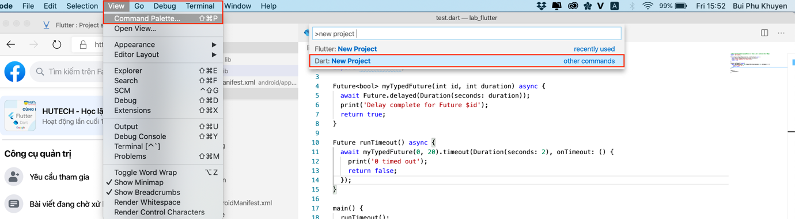
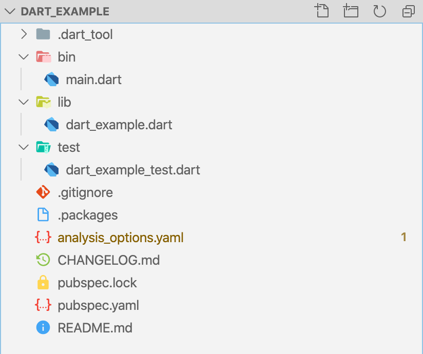
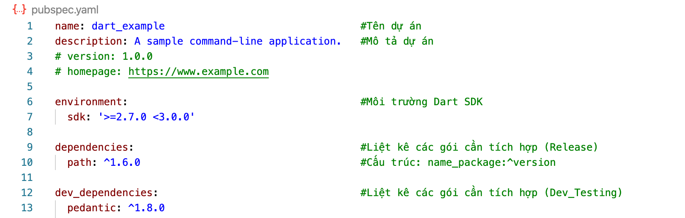
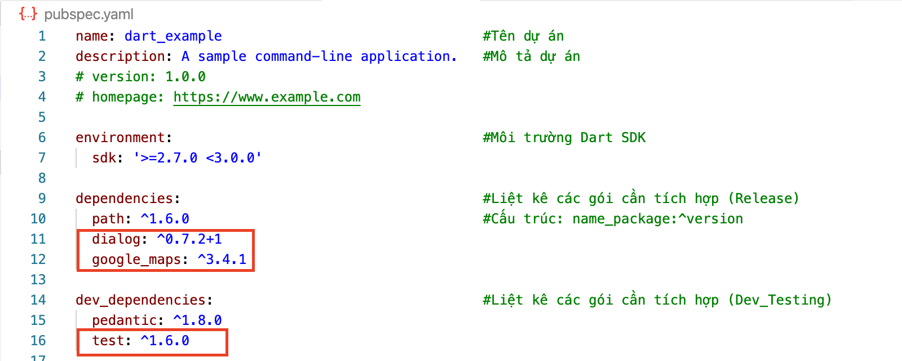

**BỘ GIÁO DỤC VÀ ĐÀO TẠO**

**Tài liệu Tham khảo**

**CÔNG NGHỆ PHẦN MỀM**

**TÌM HIỂU NGÔN NGỮ**

**DART**

>   **Sinh viên**

>   Bùi Phú Khuyên - 1611061839

**LỜI MỞ ĐẦU**

**LỜI CẢM ƠN**

*Sinh viên*

*Bùi Phú Khuyên*

**MỤC LỤC**

**BÀI 1:**

**GIỚI THIỆU NGÔN NGỮ DART**

Sẽ thật thiếu sót khi chúng ta bỏ qua ngôn ngữ lập trình được dùng trong Flutter
- Dart, vì vậy ở bài đầu tiên, ta sẽ cùng tìm hiểu về ngôn ngữ mới mẻ này.

Những thứ ta sẽ tìm hiểu trong phần này:

-   Dart là gì?

-   Tại sao Flutter lại sử dụng Dart?

-   Những ưu điểm của nó?

-   Những khái niệm quan trọng?

-   Cài đặt Dart?

-   Chạy thử và Phân tích code mẫu 1 chương trình Dart đơn giản?

1.  **DART LÀ GÌ?**

Dart là ngôn ngữ lập trình đa mục đích ban đầu được phát triển bởi Google và sau
đó được Ecma (ECMA-408) phê chuẩn làm tiêu chuẩn. Nó được sử dụng để xây dựng
các ứng dụng web, server, máy tính để bàn và thiết bị di động. Dart là ngôn ngữ
mã nguồn mở và miễn phí, được phát triển trên GitHub. Hiện nay Dart đã Release
phiên bản 2.7 (Thời điểm 2/2020). Bạn có thể tham khảo những nguồn tài liệu
chính thức của Dart tại:

-   Trang chính thức: <https://dart.dev/>

-   Editor online: <https://dartpad.dartlang.org/>

-   Thư việc packages: <https://pub.dev>

1.  **TẠI SAO FLUTTER LẠI SỬ DỤNG DART?**

Như đã nói ở trên, Dart được phát triển bởi Google, và Flutter cũng vậy. Google
muốn viết (phát triển) một ngôn ngữ mà nó cải tiến hơn Javascript và hỗ trợ cả 2
cách biên dịch là Just In Time (JIT) và Ahead Of Time (AOT):

-   Ahead Of Time (AOT): Với AOT thì trình biên dịch chuyển ngôn ngữ Dart thẳng
    sang Native Code giúp hiệu năng tốt nhất có thể (tức là khi chạy chương
    trình, nó sẽ biên dịch từ đầu đến cuối)

-   Just In Time (JIT): Còn với JIT cho phép hot reloading hoạt động, giúp phát
    triển sản phẩm nhanh và tiện dụng hơn (được hiểu như việc debug trong ngôn
    ngữ khác là debug hàm nào chạy hàm đó thì ở đây nó sẽ viết đến đâu biên dịch
    ngay đến đấy)

1.  **ƯU ĐIỂM CỦA DART:**

-   **Năng suất:** Cú pháp Dart rõ ràng và súc tích, công cụ của nó đơn giản
    nhưng mạnh mẽ. Type-safe giúp bạn xác định sớm các lỗi tinh tế. Dart có các
    thư viện cốt lõi và một hệ sinh thái gồm hàng ngàn package.

-   **Nhanh:** Dart cung cấp tối ưu hóa việc biên dịch trước thời hạn để có được
    dự đoán hiệu suất cao và khởi động nhanh trên các thiết bị di động và web.

-   **Di động:** Dart biên dịch thành mã ARM và x86, để các ứng dụng di động của
    Dart có thể chạy tự nhiên trên iOS, Android và hơn thế nữa. Đối với các ứng
    dụng web, chuyển mã từ Dart sang JavaScript.

-   **Dễ gần:** Dart quen thuộc với nhiều nhà phát triển hiện có, nhờ vào cú
    pháp và định hướng đối tượng không gây ngạc nhiên của nó. Nếu bạn đã biết
    C++, C \# hoặc Java, bạn có thể làm việc hiệu quả với Dart chỉ sau vài ngày.

-   **Reactive**: Dart rất phù hợp với lập trình Reactive, với sự hỗ trợ để quản
    lý các đối tượng tồn tại trong thời gian ngắn, chẳng hạn như các widget UI,
    thông qua phân bổ đối tượng nhanh và GC. Dart hỗ trợ lập trình không đồng bộ
    thông qua các tính năng ngôn ngữ và API sử dụng các đối tượng Future và
    Stream.

1.  **NHỮNG KHÁI NIỆM QUAN TRỌNG:**

2.  **Khái niệm cơ bản:**

Nếu như bạn học Dart, hãy luôn ghi nhớ những khái niệm quan trọng sau:

-   Do Dart là ngôn ngữ thuần OOP nên tất cả những thứ bạn gán cho biến đều là
    object, mọi object đều là instance (thể hiện) của một class. Kể cả số,
    method (hàm), và null cũng đều là object. Tất cả các object đều kế thừa từ
    [Object
    class](https://api.dart.dev/dev/2.0.0-dev.55.0/dart-core/Object-class.html).

-   Kiểu type của 1 variable (biến) là optional bởi vì Dart có thể tự suy ra
    type dựa trên giá trị truyền vào cho biến. Ví dụ:

>   var number = 42;

>   biến number được hiểu là kiểu int. Khi bạn muốn khai báo 1 variable mà type
>   của nó không được xác định, hãy sử dụng [type
>   dynamic](https://dart.dev/guides/language/effective-dart/design#do-annotate-with-object-instead-of-dynamic-to-indicate-any-object-is-allowed).

-   Như các ngôn ngữ khác, Dart hỗ trợ generic type, ví dụ như List\<int\> (1
    danh sách kiểu số nguyên) hoặc List\<dynamic\> (1 danh sách các object mà
    type không xác định, nó có thể chấp nhận mọi loại type).

-   Dart hỗ trợ top-level function (giống như main()), đồng nghĩa bạn có thể sử
    dụng hàm đó ở bất cứ đâu mà không cần thông qua tên class hay bất kỳ
    instance của class nào cả. Bạn cũng có thể tạo một hàm bên trong một hàm
    (còn gọi là nested function hoặc local function).

-   Tương tự Dart cũng hỗ trợ top-level variable.

-   Không giống với Java, Dart không hỗ trợ public, protected, và private. Nếu
    như identifier (tên biến, hàm,...) bắt đầu bởi dấu gạch dưới (_), thì nó
    private trong library của nó. Mỗi file .dart được coi là 1 library. Chi tiết
    [Libraries and
    visibility](https://dart.dev/guides/language/language-tour#libraries-and-visibility).

-   Identifier có thể bắt đầu bằng một chữ cái hoặc dấu gạch dưới (_).

-   Dart tools có thể báo cho bạn 2 loại vấn đề: warnings và errors. Warnings là
    những dấu hiểu chỉ ra rằng code của bạn có thể không hoạt động, nhưng chương
    trình của bạn vẫn có thể chạy. Errors có thể là error lúc compile-time hoặc
    run-time. Error lúc compile-time hiển nhiên sẽ khiến code bạn không chạy
    được, còn kết quả của error run-time sẽ là những
    [exceptions](https://dart.dev/guides/language/language-tour#exceptions) được
    throw ra khi chạy.

1.  **Quy tắc trình bày Code:**

Những quy tắc này không bắt buộc bạn phải tuân theo, nhưng nếu áp dụng code sẽ
trở nên sáng sủa, dễ đọc và thống nhất.

-   Nên đặt tên kiểu **UpperCamelCase** cho lớp, enums, tham số (chữ đầu của từ
    là chữ in: HttpRequest )

-   Tên file, thư viện viết chữ thường, các từ nối với nhau bởi **\_**:
    abc_xyz.dart

-   Biến, hằng, object đặt tên kiểu **lowerCamelCase**, chữ đầu các từ viết IN,
    trừ từ đầu tiên (defaultTimeout)

-   Cố gắng viết tắt khi tên trên 2 từ, lấy ký đầu viết **IN** để tạo chữ viết
    tắt (IOStream \~ InputOutputStream)

1.  **CÀI ĐẶT DART:**

2.  **Cài đặt Dart SDK:**

Dart SDK nó cung cấp những công cụ cần thiết để phát triển ứng dụng viết bằng
Dart. Tùy thuộc sử dụng môi trường nào (Windows, Linux, Mac) thì cài đặt Dart
SDK tương ứng cho môi trường đó. Để cài đặt SDK mọi người vào document của Dart
và làm theo hướng dẫn: [Get the Dart SDK](https://dart.dev/get-dart)

1.  **Các thành phần Dart SDK:**

Những thành phần cốt lõi chạy dart từ dòng lệnh gồm:

-   **dart** máy ảo VM chạy mã Dart

-   **dart2js** biên dịch Dart thành JavaScript

-   **dartanalyzer** phân tích mã viết bằng Dart

-   **dartdevc** công cụ biên dịch cho ứng dụng web

-   **dartdoc** phát sinh tài liệu API

-   **dartfmt** định dạng mã Dart (cho đẹp, cho đúng chuẩn, cho dễ đọc)

-   **pub** quản lý gói trong Dart (giống npm của NodeJS)

1.  **Lựa chọn IDE để viết code Dart:**

Có nhiều IDE phức tạp mà nó hỗ trợ Dart thông qua các plugin như: Android
Studio, IntelliJ IDEA, Visual Studio Code... Tùy mục đích phát triển ứng dụng mà
chọn IDE tương ứng. Đáp ửng đủ nhu cầu thực hành code viết bằng Dart, thì Visual
Studio Code là một lựa chọn tuyệt vời. Ở phần cơ bản về Dart ta sẽ dùng IDE này
(nó miễn phí, mã nguồn mở, rất nhiều plugin cho hầu hết các ngôn ngữ lập
trình...)

Sau khi lựa chọn được IDE phù hợp, chúng ta có thể tạo mới file nguồn với đuôi
.dart

Ngoài ra, Dart còn cung cấp cho bạn một bộ tool trên trình duyệt web được gọi là
DartPad để bạn có thể dễ dàng viết và test Dart. Bạn có thể truy cập vào DartPad
[tại đây](https://dartpad.dartlang.org/). Mặc dù DartPad là một cách tuyệt vời
để tìm hiểu cách viết một ứng dụng đơn giản, nhưng khi bạn đã sẵn sàng để phát
triển các ứng dụng thực sự, bạn cần có SDK.

1.  **CHƯƠNG TRÌNH DART ĐƠN GIẢN:**

Bạn có thể dùng bất kỳ trình soạn thảo text nào để viết code Dart (hoặc sử dụng
[DartPad](https://dartpad.dartlang.org/)), giờ bạn tạo ra một file đặt tên là
**hello.dart** với nội dung:

>   main() {

>   print('Hello World!');

>   }

Đoạn mã trên in ra màn hình dòng chữ: Hello World!. Để chạy bạn gõ lệnh từ
Terminate (Command Prompt) như sau:

>   \# cd \<thư mục chứa file hello.dart\>

>   \# dart hello.dart

>   Hello World!

Tiếp theo ta tìm hiểu thêm từ một chương trình đơn giản sau:

>   import 'dart:math'; //Nạp thư viện

>   ///Hàm tính tổng sumInt ///

>   ///Tính tổng 2 số nguyên

>   ///Trả về tổng 2 số nguyên ...

>   sumInt(int a, int b) {

>   return a + b;

>   }

>   /\*\*

>   \* Hàm main là điểm mồi ứng dụng bắt đầu chạy từ

>   \* hàm này

>   \*/

>   main(List\<String\> args) {

>   var sum; //Khai báo một biến

>   var a = 10; //Khai báo và khởi tạo biến luôn

>   sum = sumInt(a, 15); //Gọi hàm sumInt

>   print('Sum of a and b: \$sum');

>   var sqrtvalue = sqrt(sum);

>   print('Square root of 2 of \$sum is \$sqrtvalue');

>   }

Kết quả của đoạn mã trên như sau:

Đoạn code đơn giản ở trên dùng nhiều đến những tính năng cơ bản trong Dart, ta
sẽ cùng phân tích:

1.  **Hàm main:**

Một ứng dụng Dart bắt đầu chạy từ hàm main, hàm này bắt buộc phải có, nó có thể
có tham số như khai báo ở trên. Nếu ứng dụng không nhận tham số ở main thì có
thể chỉ cần khai báo:

>   main() {

>   // ...

>   }

**Lưu ý:** Dart có phân biệt chữ hoa/thường nên khi đặt tên cho các thành phần
hàm, biến... cần lưu ý. Hàm main() và hàm maIn() là khác nhau.

1.  **Câu lệnh, khối lệnh:**

Các lệnh trong Dart được viết mà các thành phần không bị ảnh hưởng bởi khoảng
trắng, kết thúc một câu lệnh là dấu **;**

>   //Câu lệnh

>   return a + b;

>   //Viết lại như sau là tương đương

>   return

>   a

>   \+

>   b;

Một nhóm các lệnh nhóm lại với nhau được gọi là một khối lệnh, trong Dart nó sử
dụng cặp dấu **{}** để tạo khối. Khối lệnh có thể lồng nhau.

>   if (a \> 1) {

>   //Khối lệnh 1

>   }

>   else {

>   //Khối lệnh 2

>   }

1.  **Comment – chú thích Code:**

Các chú thích đưa vào trong code thì không ảnh hưởng gì đến code, mục đích nó là
mô tả để đọc lại dễ hiểu, có 2 loại chú thích.

*Chú thích 1 dòng* các chữ phía sau ký hiệu // không ảnh hưởng gì tới code

>   // Đây là chú thích trên 1 dòng

*Chú thích nhiều dòng* các dòng chữ nằm giữa ký hiệu /\* và \*/ không ảnh hưởng
gì tới code.

>   /\*

>   Đây

>   là chú thích

>   nhiều dòng

>   \*/

*Chú thích Documentation* là dòng chữ phía sau ký hiệu ///, nó tương tự như chú
thích 1 dòng, nhưng nội dung viết trong nó viết theo một quy tắc nhất định để
tham khảo tới hàm, biến, lớp ... (tìm hiểu sau), nó giống PHPDoc trong PHP. Mục
đích là để sinh ra tài liệu. Ví dụ nó phát sinh ra tài liệu tham khảo, để người
khác đọc tài liệu này biết sử dụng lại logic của code.

1.  **Nạp thư viện:**

Dart cũng tổ chức code thành các thư viện, có những thư viện xây dựng sẵn như
thư viện toán dart:math ... , cần dùng thư viện nào thì nạp nó vào bằng lệnh
import. Bạn cũng sẽ tự xây dựng các thư viện cho mình và nạp vào bằng cách này,
kể cả nạp một file .dart cũng dùng import.

>   import 'dart:math'; //Nạp thư viện toán

>   //Do có nạp math, mà giờ đây có hàm tính căn bậc 2 sqrt

>   print(sqrt(9));

Trở lại dự án trên của bạn, giờ bạn tạo ra một file khác đặt tên là banner.dart

Nội dung file có định nghĩa hàm banner()

>   void banner() {

>   print("==============================================");

>   }

Sau đó trở lại main.dart, nạp file này vào bằng lệnh import 'banner.dart';, vậy
là trong main.dart gọi được hàm banner();

>   import 'dart:math';

>   import 'banner.dart'; //Nạp thư viện tự xây dựng

>   ...

>   main(List\<String\> args) {

>   banner(); //Được gọi hàm trong thư viện banner.dart

>   var sum;

>   var a = 10;

>   sum = sumInt(a, 15);

>   print('Sum of a and b: \$sum');

>   var sqrtvalue = sqrt(sum);

>   print('Square root of 2 of \$sum is \$sqrtvalue');

>   banner(); //Được gọi hàm trong thư viện banner.dart

>   }

Kết quả của chương trình:

>   ==============================================

>   Sum of a and b: 25

>   Square root of 2 25 is 5

>   ==============================================

Phiên bản Tài liệu ngày 23/02/2020

**BÀI 2:**

**LÀM QUEN VỚI NGÔN NGỮ DART**

**(Phần 1)**

Sau khi tìm hiểu một số thông tin về Dart, những ưu điểm và cách cài đặt Dart
thông qua bài 1. Ta sẽ tiếp tục làm quen với ngôn ngữ này.

Bài được chia thành 2 phần, trong phần đầu tiên ta cần biết những nội dung sau:

-   Từ khoá trong Dart?

-   Cách khai báo, khởi tạo biến?

-   Hằng số - Cách khai báo, sử dụng?

-   Các kiểu dữ liệu trong Dart?

1.  **TỪ KHOÁ?**

Bảng sau liệt kê các từ mà ngôn ngữ Dart xử lý đặc biệt:

| [abstract](https://dart.dev/guides/language/language-tour#abstract-classes) 2         | [dynamic](https://dart.dev/guides/language/language-tour#important-concepts) 2             | [implements](https://dart.dev/guides/language/language-tour#implicit-interfaces) 2                      | [show](https://dart.dev/guides/language/language-tour#importing-only-part-of-a-library) 1 |
|---------------------------------------------------------------------------------------|--------------------------------------------------------------------------------------------|---------------------------------------------------------------------------------------------------------|-------------------------------------------------------------------------------------------|
| [as](https://dart.dev/guides/language/language-tour#type-test-operators) 2            | [else](https://dart.dev/guides/language/language-tour#if-and-else)                         | [import](https://dart.dev/guides/language/language-tour#using-libraries) 2                              | [static](https://dart.dev/guides/language/language-tour#class-variables-and-methods) 2    |
| [assert](https://dart.dev/guides/language/language-tour#assert)                       | [enum](https://dart.dev/guides/language/language-tour#enumerated-types)                    | [in](https://dart.dev/guides/language/language-tour#for-loops)                                          | [super](https://dart.dev/guides/language/language-tour#extending-a-class)                 |
| [async](https://dart.dev/guides/language/language-tour#asynchrony-support) 1          | [export](https://dart.dev/guides/libraries/create-library-packages) 2                      | [interface](https://stackoverflow.com/questions/28595501/was-the-interface-keyword-removed-from-dart) 2 | [switch](https://dart.dev/guides/language/language-tour#switch-and-case)                  |
| [await](https://dart.dev/guides/language/language-tour#asynchrony-support) 3          | [extends](https://dart.dev/guides/language/language-tour#extending-a-class)                | [is](https://dart.dev/guides/language/language-tour#type-test-operators)                                | [sync](https://dart.dev/guides/language/language-tour#generators) 1                       |
| [break](https://dart.dev/guides/language/language-tour#break-and-continue)            | [external](https://stackoverflow.com/questions/24929659/what-does-external-mean-in-dart) 2 | [library](https://dart.dev/guides/language/language-tour#libraries-and-visibility) 2                    | [this](https://dart.dev/guides/language/language-tour#constructors)                       |
| [case](https://dart.dev/guides/language/language-tour#switch-and-case)                | [factory](https://dart.dev/guides/language/language-tour#factory-constructors) 2           | [mixin](https://dart.dev/guides/language/language-tour#adding-features-to-a-class-mixins) 2             | [throw](https://dart.dev/guides/language/language-tour#throw)                             |
| [catch](https://dart.dev/guides/language/language-tour#catch)                         | [false](https://dart.dev/guides/language/language-tour#booleans)                           | [new](https://dart.dev/guides/language/language-tour#using-constructors)                                | [true](https://dart.dev/guides/language/language-tour#booleans)                           |
| [class](https://dart.dev/guides/language/language-tour#instance-variables)            | [final](https://dart.dev/guides/language/language-tour#final-and-const)                    | [null](https://dart.dev/guides/language/language-tour#default-value)                                    | [try](https://dart.dev/guides/language/language-tour#catch)                               |
| [const](https://dart.dev/guides/language/language-tour#final-and-const)               | [finally](https://dart.dev/guides/language/language-tour#finally)                          | [on](https://dart.dev/guides/language/language-tour#catch) 1                                            | [typedef](https://dart.dev/guides/language/language-tour#typedefs) 2                      |
| [continue](https://dart.dev/guides/language/language-tour#break-and-continue)         | [for](https://dart.dev/guides/language/language-tour#for-loops)                            | [operator](https://dart.dev/guides/language/language-tour#overridable-operators) 2                      | [var](https://dart.dev/guides/language/language-tour#variables)                           |
| [covariant](https://dart.dev/guides/language/sound-problems#the-covariant-keyword) 2  | [Function](https://dart.dev/guides/language/language-tour#functions) 2                     | [part](https://dart.dev/guides/libraries/create-library-packages#organizing-a-library-package) 2        | [void](https://medium.com/dartlang/dart-2-legacy-of-the-void-e7afb5f44df0)                |
| [default](https://dart.dev/guides/language/language-tour#switch-and-case)             | [get](https://dart.dev/guides/language/language-tour#getters-and-setters) 2                | [rethrow](https://dart.dev/guides/language/language-tour#catch)                                         | [while](https://dart.dev/guides/language/language-tour#while-and-do-while)                |
| [deferred](https://dart.dev/guides/language/language-tour#lazily-loading-a-library) 2 | [hide](https://dart.dev/guides/language/language-tour#importing-only-part-of-a-library) 1  | [return](https://dart.dev/guides/language/language-tour#functions)                                      | [with](https://dart.dev/guides/language/language-tour#adding-features-to-a-class-mixins)  |
| [do](https://dart.dev/guides/language/language-tour#while-and-do-while)               | [if](https://dart.dev/guides/language/language-tour#if-and-else)                           | [set](https://dart.dev/guides/language/language-tour#getters-and-setters) 2                             | [yield](https://dart.dev/guides/language/language-tour#generators) 3                      |

Bạn không thể dụng những keyword (từ khoá) này như một identifier (tên biến,
hàm…). Tham khảo thêm [tại
đây.](https://dart.dev/guides/language/language-tour#keywords)

1.  **KHAI BÁO – KHỞI TẠO BIẾN:**

Biến để lưu các đối tượng khi ứng dụng hoạt động, để tạo ra biến dùng từ khóa
**var** (optional variable) với cú pháp như sau.

>   main() {

>   // Khai báo biến a, khởi tạo nó lưu một chuỗi

>   // (do vậy a có kiểu String, nó chỉ lưu chuỗi)

>   var a = "Learn Dart";

>   a = "Learn Dart 2"; // Gán chuỗi khác

>   a = 100; // Lỗi Compile-time vì gán số vào a

>   // Khai báo và không khởi tạo

>   // biến b sẽ có giá trị null - lúc này

>   // kiểu của b tùy thuộc vào giá trị gán vào nó

>   var b;

>   b = 100; // Gán số vào b

>   b = "aaa"; // Gán chuỗi vào b

>   }

Bạn cũng có thể khai báo và chỉ định kiểu dữ liệu cụ thể cho nó luôn, khi chỉ
định kiểu cụ thể mỗi khi gán dữ liệu vào biến thì giá trị phải cùng kiểu

>   String s = 'Chuỗi ký tự'; // Khai báo biến chuỗi

>   double d = 1.1234; // Khai báo biến số thực

>   int i = 1; // Biến số nguyên

>   bool found = true; // Biến logic (boolean)

Trong trường hợp bạn sử dụng biến mà biến đó không xét đến kiểu (chấp nhận gán
vào nó nhiều loại kiểu) thì dùng từ khóa **dynamic**

>   dynamic dyn = 123; // Khởi tạo là số int

>   dyn = "Dynamic"; // Gán chuỗi

>   dyn = 1.12345; // Gán số double

**Giá trị mặc định (Default value):**

Nếu 1 variable không được khởi tạo, thì giá trị mặc định của chúng là null. Ngay
kể cả chúng là kiểu int thì nếu không tạo thì giá trị mặc định vẫn là null, vì
mọi thứ trong Dart đều là object.

>   int lineCount;

>   assert(lineCount == null);

**Lưu ý:** Hàm assert() bị bỏ qua trong mã production. Trong quá trình phát
triển, assert(condition) đưa ra một ngoại lệ trừ khi điều kiện là đúng. Để biết
chi tiết, [xem Assert.](https://dart.dev/guides/language/language-tour#assert)

1.  **HẰNG SỐ - KHAI BÁO & SỬ DỤNG:**

Hằng số lưu giá trị mà không thể thay đổi, sử dụng từ khóa **const** hoặc
**final** để tạo ra hằng số; thay cho **var** hoặc đi kèm cùng các type khác như
int, String, double...

1.  **Tạo hằng số const:**

>   const tên_hằng_số = biểu_thức_giá_trị;

>   //Ví dụ

>   const day_0 = 'Sunday';

>   const day_1 = 'Monday';

>   const minutes = 24 \* 60;

Cách khai báo **const** như trên gọi là hằng số lúc biên dịch (compile-time),
giá trị của nó phải là cụ thể ngay lúc bạn viết code.

1.  **Tạo hằng số final:**

Thực ra đây giống như khai báo biến, nhưng biến **final** chỉ được gán một lần
duy nhất, gán lần thứ 2 sẽ lỗi (trước khi sử dụng phải có 1 lần gán). Nó gọi là
hằng số lúc chạy (run-time), giá trị hằng số này có thể khác nhau mỗi lần chạy.

Cú pháp như sau:

>   final name_1 = biểu_thức_giá_trị;

>   final String name_2 = biểu_thức_giá_trị; //Chỉ rõ luôn kiểu của hằng

Xét 1 chương trình mẫu sau:

>   var number_rand = Random(1000).nextInt(500);

>   //Tạo hằng số final

>   final a = number_rand \* 2;

Như ví dụ trên, tạo ra hàng số a. Hằng số này sau khi khởi tạo thì không thay
đổi nữa. Vấn đề hằng số này được khởi tạo bằng một giá trị ngẫu nhiên sinh ra
bởi hàm Random, vậy mỗi lần chạy ứng dụng hằng số này có thể có giá trị khác
nhau. Nó khác với **const** là cố định ngay từ khi viết code (hằng số biên
dịch).

Ví dụ sau sẽ bị lỗi:

>   var number_rand = Random(1000).nextInt(500);

>   const a = number_rand \* 2;

>   \--Output: test.dart:7:13: Error: Not a constant expression.

Lỗi vì bạn không thể biết a bằng bao nhiêu khi đọc code

1.  **CÁC KIỂU DỮ LIỆU TRONG DART:**

Dart đang hỗ trợ các nhóm kiểu dữ liệu: Number (Số), String (Chuỗi), Logic
(Đúng/Sai), Symbol (Biểu tượng), Runes (Chuỗi Unicode 32-bit).

1.  **Numbers (Số):**

Các kiểu số trong Dart tồn tại dưới 2 dạng chính:
[int](https://api.dart.dev/dev/2.8.0-dev.10.0/dart-core/int-class.html) và
[double](https://api.dart.dev/dev/2.8.0-dev.10.0/dart-core/double-class.html).

Cả int và double đều là subtypes của
[num](https://api.dart.dev/dev/2.8.0-dev.10.0/dart-core/num-class.html). Do
chúng đều là object nên có khá nhiều method hỗ trợ như abs(), ceil() làm tròn
lên, floor() làm tròn xuống. Nếu bạn muốn nhiều hơn thư viện dart:math có thể
giúp bạn.

>   int x = 1;

>   int hex = 0xDEADBEEF;

>   double y = 1.1;

>   double exponents = 1.42e5;

Dưới đây là cách bạn chuyển từ **string** sang số và ngược lại:

>   //String -\> int

>   var one = int.parse('1');

>   assert(one == 1);

>   // String -\> double

>   var onePointOne = double.parse('1.1');

>   assert(onePointOne == 1.1);

>   // int -\> String

>   String oneAsString = 1.toString();

>   assert(oneAsString == '1');

>   // double -\> String

>   String piAsString = 3.14159.toStringAsFixed(2);

>   assert(piAsString == '3.14');

1.  **String (Chuỗi):**

>   var s1 = 'Single quotes work well for string literals.';

>   var s2 = "Double quotes work just as well.";

Để tạo 1 string, bạn có thể dụng nháy đơn ' hoặc nháy kéo ". Đặc biệt, bạn có
thể truyền value (giá trị) vào trong string rất đơn giản \$variable (tên biến)
hoặc \${expression} (biểu thức):

>   String s1 = "Bui Phu Khuyen";

>   String s2 = "Dart";

>   print("\$s1");

>   print("\${s1 + '_' + s2.toUpperCase()}");

>   \--Output: Bui Phu Khuyen D  
>   Bui Phu Khuyen_DART S

Muốn nhập chuỗi trên nhiều dòng, dùng cú pháp sau (các dòng nằm giữa cặp '''
hoặc """);

>   var s1 = '''You can create

>   multi-line strings like this one.''';

>   var s2 = """This is also a

>   multi-line string.""";

>   \--Output: d d d d  
>   You can create d  
>   multi-line strings like this one. d d

>   This is also a d d d.  
>   multi-line string. d d d

Bạn có thể tạo "raw" string bằng cách thêm đằng trước **r**:

>   var s = **r**"In a raw string, even \\n isn't special.";

Raw String bạn có thể hiểu là nó sẽ hiển thị đúng như những gì bạn ghi lên, giả
sử như đoạn code trên **\\n** sẽ không được coi là xuống dòng nữa.

1.  **Bool (Đúng/Sai):**

Biểu diễn logic đúng / sai với hai giá trị **true** và **false.**

>   bool found = true;

>   if (found) {

>   //Do something

>   }

1.  **Runes (Chuỗi Unicode 32-bit):**

Trong Dart, rune là các điểm mã UTF-32 của một chuỗi. Unicode xác định một giá
trị số duy nhất cho mỗi chữ cái, chữ số và ký hiệu được sử dụng trong tất cả các
hệ thống chữ viết của thế giới. Bởi vì chuỗi Dart là một chuỗi các đơn vị mã
UTF-16, việc thể hiện các giá trị Unicode 32 bit trong một chuỗi đòi hỏi cú pháp
đặc biệt. Cách thông thường để thể hiện điểm mã Unicode là \\uXXXX, trong đó
XXXX là giá trị thập lục phân 4 chữ số. Ví dụ: ký tự trái tim (♥) là \\u2665. Để
chỉ định nhiều hơn hoặc ít hơn 4 chữ số hex, đặt giá trị trong dấu ngoặc nhọn.
Ví dụ: biểu tượng cảm xúc cười (😆) là \\u{1f600} .

Ta xem một chương trình minh hoạ sau:

>   Runes input = Runes( '\\u2665 \\u{1f605} \\u{1f60e} \\u{1f47b}');

>   print(String.fromCharCodes(input));

Kết quả của chương trình là:

♥ 😅 😎 👻

1.  **Symbol (Biểu tượng):**

>   Một đối tượng Biểu tượng đại diện cho một toán tử hoặc mã định danh được
>   khai báo trong chương trình Dart. Bạn có thể không bao giờ cần sử dụng các
>   ký hiệu, nhưng chúng là vô giá đối với các API tham chiếu đến các mã định
>   danh theo tên, bởi vì thu nhỏ thay đổi tên định danh nhưng không phải là ký
>   hiệu định danh.

>   Để lấy ký hiệu cho mã định danh, hãy sử dụng ký hiệu bằng chữ, chỉ \# theo
>   sau là mã định danh:

>   \#radix

>   \#bar

Biểu tượng chữ là hằng số thời gian biên dịch. Bạn có thể xem thêm thông tin về
Symbol [tại đây](https://dart.dev/guides/language/language-tour#symbols).

Phiên bản Tài liệu ngày 23/02/2020

**BÀI 2:**

>   **LÀM QUEN VỚI NGÔN NGỮ DART**

**(Phần 2)**

Ở phần 1 bài trước, ta đã tìm hiểu sơ qua 1 số khái niệm về từ khoá, biến, hằng
số và các kiểu dữ liệu trong Dart. Trong phần tiếp theo, ta cần biết một số nội
dung sau:

-   Toán tử? (Số học, Gán, So sánh, Logic, Biểu thức Điều kiện,…)

-   Câu điều kiện, vòng lặp trong Dart?

-   Hàm trong Dart?

-   Cấu trúc dữ liệu thường dùng (Enum, Interable, List, Set, Map)?

1.  **TOÁN TỬ:**

2.  **Toán tử số học:**

| **Toán tử**    | **Ý nghĩa**                                                                        |
|----------------|------------------------------------------------------------------------------------|
| **+**          | Phép cộng. 5 + 6 kết quả 11                                                        |
| **-**          | Phép trừ. 5 - 6 kết quả -1                                                         |
| **\***         | Phép nhân                                                                          |
| **/**          | Phép chia. 5 / 6 kết quả 0.8333333333333334                                        |
| **\~/**        | Phép chia lấy phần nguyên. 6 \~/ 4 kết quả 1                                       |
| **%**          | Phép chia modulo (lấy phần dư) 6 % 4 kết quả 2                                     |
| **-biểu_thức** | Đổi dấu kết quả biểu thức -(5 - 6) kết quả 1                                       |
| **++var**      | var = var + 1. Thêm 1 vào var, trong biểu thức việc tăng này được thực hiện trước. |
| **var++**      | var = var + 1. Thêm 1 vào var, trong biểu thức việc tăng này được thực hiện sau.   |
| **--var**      | var = var - 1. Bớt var đi 1, việc bớt này thực hiện trước trong biểu thức.         |
| **var--**      | var = var - 1. Bớt var đi 1, việc bớt này thực hiện sau trong biểu thức.           |

>   var a = 5;

>   var b = 6;

>   print(a \* b); //30

>   var a = 5;

>   var c = 10 + (++a); //a tăng thêm 1, a thành 6

>   print(a); //6

>   print(c); //16

>   var a = 5;

>   var c = 10 + (a++); //Tính c với a = 5, sau đó mới tăng a

>   print(a); //6

>   print(c); //15

1.  **Phép gán:**

Phép gán là =, để thực hiện gán giá trị biểu thức bên phải vào biến ở phía bên
trái toán tử.

>   **biến = biểu_thức;**

>   var a = 1 + 2 + 3 + 4; //Gán phép toán cho biến a

Phép toán gán có trường hợp viết phức tạp kết hợp cùng một toán tử khác phía
trước dạng **toán_tử_trước=** như **+=, -=, \*=, /\*** ... Điều này có nghĩa là
biến và biểu thức bên phải thực hiện toán tử phía trước, giá trị được bao nhiêu
gán vào biến.

>   a \*= 5; // Tương đương a = a \* 5;

>   a += 5; // Tương đương a = a + 5;

>   a /= 5; // Tương đương a = a / 5;

1.  **Toán tử so sánh:**

Các toán tử này thực hiện trên biểu thức **logic**, kết quả là **true** hoặc
**false**

| **Toán tử** | **Ý nghĩa**                                               |
|-------------|-----------------------------------------------------------|
| ==          | So sánh bằng 5 == 5 kết quả true, 5 == 6 kết quả false    |
| !=          | So sánh khác 5 != 5 kết quả false, 5 != 6 kết quả true    |
| \>          | So sánh lớn hơn 5 \> 5 kết quả false, 6 \> 5 kết quả true |
| \<          | So sánh nhỏ hơn 5 \< 5 kết quả false, 5 \< 6 kết quả true |
| \<=         | So sánh nhỏ hơn hoặc bằng                                 |
| \>=         | So sánh lớn hơn hoặc bằng                                 |

1.  **Toán tử logic:**

| **Toán tử** | **Ý nghĩa**                                                       |
|-------------|-------------------------------------------------------------------|
| \|\|        | Phép logic **hoặc**, a\|\|b kết quả true nếu a hoặc b là true     |
| &&          | Phép logic **và**, a&&b kết quả true nếu a và b đều true          |
| !biểu_thức  | Phép **phủ định** !a nếu a là true thì kết quả phép toán là false |

2.  **Biểu thức điều kiện:**

>   **biểu_thức_điều_kiện ? biểu_thức_1 : biểu_thức_2**

Biểu thức tổng hợp trên kết hợp từ ba biểu thức con (còn được gọi với cái tên
khác là toán tử ba ngôi). Nếu **biểu_thức_điều_kiện** là **đúng** thì giá trị
tính theo **biểu_thức_1**, ngược lại là **biểu_thức_2.**

>   var a = 5;

>   var b = 10;

>   var c = (a \> b) ? a : b; //Kết quả c = 10

>   **biểu_thức_1 ?? biểu_thức_2**

Biểu thức kết hợp với **??**, nếu **biểu_thức_1** khác **null** thì lấy
**biểu_thức_1**, ngược lại lấy giá trị từ **biểu_thức_2.**

>   var a = 5;

>   var b;

>   var c = a ?? b; //Kết quả c = 5

1.  **Một số toán thử trên lớp, đối tượng:**

| **Toán tử** | **Ý nghĩa**                                                                               |
|-------------|-------------------------------------------------------------------------------------------|
| **[]**      | Truy cập phần tử mảng                                                                     |
| **.**       | Truy cập phương thức, thuộc tính đối tượng                                                |
| **?.**      | Truy cập phương thức, thuộc tính đối tượng khi đối tượng đó khác null myobject?.method(); |
| **as**      | Chuyển kiểu: (var as MyClass)                                                             |
| **is**      | Kiểm tra kiểu: (var is MyClass)                                                           |
| **is!**     | Kiểm tra kiểu: (var is! MyClass)                                                          |
| **..**      | Thực hiện chuỗi hoạt động trên cùng một đối tượng                                         |

2.  **CÂU ĐIỀU KIỆN, VÒNG LẶP:**

3.  **Câu lệnh if - else:**

Dạng 1, thực hiện khối lệnh khi biểu thức logic kiểm tra là **true**:

>   if (biểu_thức) {

>   //Viết lệnh chạy khi biểu_thức là true

>   }

Dạng 2, nếu điều kiện là đúng thực hiện khối lệnh 1, nếu sai thực hiện khối lệnh
2.

>   if (biểu_thức) {

>   //Viết lệnh chạy khi biểu_thức là true

>   } else {

>   //Viết lệnh chạy khi biểu thức là false

>   }

>   //CÓ THỂ VIẾT NHIỀU LỆNH IF

>   if (biểu_thức_1) {

>   //..Các câu lệnh

>   } else if (biểu_thức_2) {

>   //Các câu lệnh

>   } else if (biểu_thức_3) {

>   //Các câu lệnh

>   } else {

>   //Các câu lệnh

>   }

Ví dụ:

>   var a = 15;

>   if (a \< 10) {

>   print('a nhỏ hơn 10');

>   } else if (a \< 5) {

>   print('a nhỏ hơn 5');

>   }

>   else {

>   print('a lớn hơn hoặc bằng 15');

>   }

1.  **Câu lệnh rẽ nhánh switch:**

Khi cần rẽ nhiều nhánh, thay vì dùng nhiều lệnh **if else** ở trên thì có thể
dùng **switch** với cú pháp.

>   switch (biểu_thức) {

>   case : giá_trị_1

>   // Khối lệnh

>   break;

>   case : giá_trị_2

>   //Khối lệnh

>   break;

>   default :

>   //Khối lệnh mặc định

>   }

Giá trị của **biểu_thức** được so sánh với các giá trị **giá_trị_1, giá_trị_2**
... nếu bằng cái nào thì thi hành khối lệnh bắt đầu tử điểm đó cho đến khi gặp
**break;**

Nếu có khối **default** thì khi không có giá trị nào phù hợp sẽ thi hành khối
này.

>   var t = 1;

>   switch(t) {

>   case 0:

>   print('Bui'); break;

>   case 1:

>   print('Phu'); break;

>   default:

>   print('Khuyen');

>   } //Kết quả: Phu

1.  **Vòng lặp for:**

Cú pháp:

>   for (statement1; statement2; statement3) {

>   //Khối lệnh thi hành

>   }

-   **statement1:** lệnh thi hành trước khi vòng lặp **for** bắt đầu.

-   **statement2:** điều kiện kiểm tra trước mỗi lần thi hành khối lệnh **for**
    (**true** thì khối lệnh sẽ thi hành, **false** sẽ khối for sẽ không thi hành
    - thoát lặp).

-   **statement3:** thi hành sau mỗi lần một vòng hoàn thành.

Ví dụ:

>   for (var i=1; i\<=5; i++) {

>   print(i);

>   }

>   //Kết quả

>   1

>   2

>   3

>   4

>   5

Có thể bỏ qua **statement1** (vẫn giữ lại dấu **;**)

>   var i = 1;

>   for (; i\<=5; i++) {

>   print(i);

>   }

Tương tự bạn có thể bỏ qua **statement3** và **statement2** (vẫn giữ **;**), lưu
ý bạn cũng có thể sử dụng lệnh **break;** để thoát vòng lặp.

>   var i = 0;

>   for (; ; i+=2) {

>   if (k\>10) break;

>   print(k);

>   }

>   //Kết quả

>   2

>   4

>   6

>   8

>   10

1.  **Vòng lặp while:**

>   Thi hành khối lệnh khi mà điều kiện kiểm tra vẫn là true

>   while (điều_kiện) {

>   //Khối lệnh

>   }

Đầu tiên nó kiểm tra điều kiện, nếu **true** sẽ thi hành khối lệnh. Đến cuối
khối lại kiểm tra điều kiện, nếu điều kiện vẫn là **true** thì lại tiếp tục thì
hành vòng mới của khối lệnh. Ví dụ:

>   var i = 0;

>   while (i\<=5) {

>   print(i);

>   i++;

>   }

>   //Kết quả

>   0

>   1

>   2

>   3

>   4

>   5

Lưu ý về việc sau một số vòng thì điều kiện phải là **false** nếu không vòng lặp
sẽ lặp lại vô tận.

1.  **Vòng lặp do while:**

Giống với vòng lặp **while** nhưng khối lệnh thi hành luôn mà không kiểm tra
điều kiện trước, khi khối lệnh thi hành xong mới kiểm tra điều kiện để xem có
lặp lại hay không. Cú pháp như sau:

>   do {

>   //Khối lệnh

>   }

>   while (condition);

Ví dụ:

>   var i = 10;

>   do {

>   print(i);

>   i++;

>   }

>   while (i\<=15);

>   //Kết quả

>   10

>   11

>   12

>   13

>   14

>   15

Lưu ý: Vòng lặp **do ... while** khối lệnh luôn được thi hành ít nhất một lần.

1.  **Lệnh continue và break:**

Trong vòng lặp khi gặp **continue;** nó sẽ bỏ qua các lệnh còn lại và khởi tạo
vòng lặp mới luôn. Còn nếu gặp **break;** thì bỏ qua các lệnh còn lại đồng thời
thoát khỏi vòng lặp. Ví dụ:

>   for (i = 1; i \<= 1000; i++) {

>   if (i == 5) {

>   continue; //Khởi tạo vòng lặp mới luôn

>   }

>   print(i);

>   if (i \> 6) {

>   break; //Thoát vòng lặp nếu i \> 6

>   }

>   }

>   //Kết quả (Bỏ qua in số 5)

>   1

>   2

>   3

>   4

>   6

>   7

Lệnh **continue** còn dùng để nhảy đến một khối lệnh có nhãn bằng cú pháp:

>   **continue nhãn_khối_lệnh;**

Lệnh **break** còn dùng để hủy thi hành khối lệnh bên ngoài có nhãn, với cú
pháp:

>   **break nhãn_khối_lệnh_ngoài;**

Phần nói về các đối tượng có kiểu liệt kê được (Ví dụ như mảng, danh sách ...),
còn có các lệnh duyệt qua từng phần tử liệt kê được đó với các lệnh **for ...
in, for ... of.**

1.  **Test với Assert:**

Dart cung cấp lệnh:

>   **Assert(biểu_thức_logic);**

Để khi chạy mà biểu thức logic sai sẽ dừng chương trình ở đó. **Assert** là cách
để kiểm tra một biểu thức, vấn đề là nó không có ảnh hưởng gì khi chạy ở chế độ
product nó chỉ tác dụng khi phát triển (Chạy debug Ctrl + F5 trong VS)

>   // Đảm bảo một đối tượng khác null

>   assert(myobject != null);

>   // Đảm bảo số lớn hơn 100

>   sassert(number \> 100);

1.  **XÂY DỰNG HÀM:**

2.  **Hàm trong Dart:**

Hàm là một khối lệnh thực hiện một tác vụ gì đó, khối lệnh này được dùng nhiều
lần nên gom chúng tại thành một hàm. Trong Dart mọi thứ đều là đối tượng nên hàm
cũng là một đối tượng (kế thừa Function). Đây là một khai báo hàm:

>   double Sum(double a, double b, double c) {

>   return a + b + c;

>   }

>   //Gọi hàm

>   var x = Sum(1, 2, 3);

>   print(x);

>   //Kết quả 6.0

Như vậy khi khai báo hàm ta có thể có các thành phần sau:

-   Chỉ ra kiểu giá trị trả về của hàm (ví dụ **double**), giá trị trả về bằng
    biểu thức của lệnh **return**. Với Dart thiếu việc khai báo kiểu giá trị trả
    về hàm vẫn hoạt động tốt. Còn khi có chỉ rõ kiểu trả về thì giá trị trong
    biểu thức **return** phải trùng với kiểu khai báo hàm.

-   Tham số được liệt kê sau tên hàm trong cặp **()** như trên có ba tham số
    **a, b, c**.

-   Hàm kết thúc khi chạy hết khối lệnh hoặc gặp lệnh **return**, giá trị hàm là
    biểu thức sau **return**, nếu thiếu giá trị hàm sẽ là null.

-   Gọi hàm thì viết tên hàm và truyền đúng tham số theo thứ tự khi khai báo.

1.  **Hàm với tên tham số tuỳ chọn (Optional named parameters):**

Khi gọi 1 hàm (**function**), bạn có truyền giá trị thông qua tên biến
**paramName: value**, việc này giúp việc đọc code dễ dàng hơn trong các trường
hợp hàm (**function**) có quá nhiều tham số (**parameter**).

Để làm được thế, hàm phải khai báo tham số ở trong **{ }**, Ví dụ: **{param1,
param2,…}**

>   String Label( **{**String surName, String midName, String frsName **}**) {

>   return surName + midName + frsName;

>   }

>   var result = Label(surName: 'Bui ', midName: 'Phu ', frsName: 'Khuyen ');

>   print(result); //Bui Phu Khuyen

1.  **Hàm với tham số tuỳ chọn (Optional positional parameters):**

Các tham số tùy chọn của hàm có nghĩa là khi họi hàm có sử dụng hoặc không. Các
tham số tùy chọn gom lại trong **[ ]**, nếu khi gọi hàm không có tham số này thì
nó nhận giá trị **null**

>   double Sum(double a, [double b, double c]) {

>   var result = a;

>   if (b != null)

>   result += b;

>   result += (c!=null) ? c: 0;

>   return result;

>   }

>   print(Sum(1)); //1.0

>   print(Sum(1,2)); //3.0;

>   print(Sum(1,2,3)); //6.0;

1.  **Giá trị tham số mặc định của hàm (Default parameter values):**

Giá trị tham số mặc định của hàm (Default parameter values) được sử dụng nếu bạn
muốn tham số có giá trị mặc định, nghĩa là khi gọi hàm mà thiếu giá trị cho tham
số đó, thì nó sẽ nhận mặc định. Ví dụ:

>   double Sum(double a, {double b=1, double c=2}) {

>   return a + b + c;

>   }

>   var result_1 = Sum(1);

>   print(result_1); //4.0

>   var result_2 = Sum(1, c:10);

>   print(result_2); //12.0

>   var result_3 = Sum(1, c:2, b:10);

>   print(result_3); //13.0

Hàm trên tham số b mặc định là 1, c mặc định là 2. Nếu không chỉ ra tham số này
khi gọi nó sẽ dùng mặc định, còn muốn chỉ ra khi gọi thì truyền theo cú pháp
tên_tham_số:giá_trị, như ví dụ trên: tinhtong(1, c:2, b:10)

1.  **Hàm với Ký hiệu mũi tên =\> (=\> expression):**

>   Với những hàm **chỉ có một** biểu thức (expression) trả về luôn, thì có thể
>   có cách viết ngắn gọn bằng ký hiệu mũi tên:

>   double Sum(var a, var b) {

>   return a + b;

>   }

>   // Có thể viết lại thành

>   double Sum(var a, var b) **=\>** a + b;

Nghĩa là: =\> expression là cách viết gọn của { return expression; }

**Lưu ý:** Chỉ có biểu thức (expression) đứng đằng sau =\>, không áp dụng cho
câu lệnh (statement).

Ví dụ: Bạn không thể để if statement đằng sau =\> được. Tuy nhiên bạn có thể sử
dụng toán tử ba ngôi:

>   **condition ? expr1 : expr2**

1.  **CẤU TRÚC DỮ LIỆU THƯỜNG DÙNG:**

2.  **Cấu trúc dữ liệu liệt kê Enum:**

>   Trong Dart đây là một loại lớp đặc biệt, biểu diễn một tập hợp cố định các
>   hằng số. Để tạo ra một **enum** dùng từ khóa **enum** khai báo các phần tử
>   liệt kê theo tên cách nhau bởi **','** Ví dụ:

>   enum UserGroup {guest, member, admin}

>   **Enum** rất tiện lợi dùng với câu lệnh **switch-case:**

>   var user_group = UserGroup.admin;

>   switch (user_group) {

>   case UserGroup.admin:

>   print('Quản trị hệ thống');

>   break;

>   case UserGroup.guest:

>   print('Khách');

>   break;

>   default:

>   print('Thành viên');

>   }

>   //Kết quả: Quản trị hệ thống

1.  **Cấu trúc dữ liệu Iterable:**

Iterable là một lớp generic biểu diễn tập hợp dữ liệu mà có thể duyệt qua hết
phần tử này đến phần tử khác. Nghĩa là nó hỗ trợ moveNext() để đi đến phần tử
tiếp theo, lấy dữ liệu phần tử hiện tại bằng iterator.current.

Thường thì Iterable được tạo ra, liên kết với một loại kiểu dữ liệu tập hợp khác
như List, Map... Xem các loại cấu trúc dữ liệu này để tìm hiểu về Interable

Duyệt qua các phần tử Iterable:

>   //Sinh ra Iterable chứa 100 phần tử số từ 0 - đến 99

>   var iterable = Iterable.generate(100);

>   for (var item in iterable) {

>   print(item);

>   }

>   //Kết quả: 0

>   1

>   ...

>   99

Hoặc duyệt qua bằng forEach:

>   iterable.forEach((item) {

>   print(item);

>   });

**Các phương thức / thuộc tính hay dùng trên mảng - danh sách:** [(Xem
thêm)](https://api.dart.dev/stable/2.7.1/dart-core/Iterable-class.html)

| **Phương thức** | **Sử dụng**                                                                |
|-----------------|----------------------------------------------------------------------------|
| **isEmpty**     | Thuộc tính kiểm tra xem mảng rỗng                                          |
| **isNotEmpty**  | Thuộc tính kiểm tra xem mảng không rỗng                                    |
| **length**      | Thuộc tính trả về số lượng phần tử mảng                                    |
| **first**       | Thuộc tính trả về phần tử đầu tiên, tương đương với [0], lỗi nếu mảng rỗng |
| **last**        | Thuộc tính trả về phần tử đầu cuối                                         |
| **forEach()**   | Duyệt qua các phần tử                                                      |

1.  **Cấu trúc dữ liệu Danh sách – Mảng – List:**

>   Trong Dart, danh sách (cũng là mảng) được định nghĩa từ lớp generic List, nó
>   chứa một tập hợp các dữ liệu - mỗi dữ liệu trong List là gọi là phần tử, vị
>   trí của nó xác định bằng chỉ số bắt đầu từ 0, truy cập đến mảng (danh sách)
>   dùng ký hiệu [] chứa chỉ số phần tử. Có 2 loại List, đó là loại mà số phần
>   tử có thể thay đổi và loại list có số phần tử cố định:

1.  **Khởi tạo một mảng cố định:**

>   //Khai báo mảng cố định 2 phần tử

>   var listState = List(2);

>   //Khởi tạo các phần tử trong mảng

>   listState[0] = 'on';

>   listState[1] = 'off';

>   //Nếu truy cập listState[2] sẽ lỗi- vì List chỉ có 2 phần tử

>   print(listState); //[on, off]

1.  **Khởi tạo một mảng thay đổi số phần tử được:**

Nếu khi khởi tạo mà không chỉ ra số lượng phần tử thì nó là mảng thay đổi số
phần tử được, lúc này có thể áp dụng các hàm thêm, bớt phần tử sẽ nói phía dưới:

>   //Khai báo mảng thay đổi được

>   var day = List();

>   //Thêm các phần tử vào mảng

>   day.add('Monday');

>   day.add('Tuesday');

>   day.add('Thursday');

>   print(day); //[Monday, Tuesday, Thursday]

>   //Xóa phần tử cuối cùng

>   day.removeLast();

>   print(day); //[Monday, Tuesday]

Nếu muốn tạo ra mảng thay đổi được, và khởi tạo luôn dữ liệu ở phần khai báo thì
dùng ký hiệu **[]**

>   //Khởi tạo mảng với 2 phần tử

>   var group = ['member', 'admin'];

>   group.insert(0, 'guest'); //Chèn phần tử vào vị trí 0

>   print(group); //[guest, member, admin]

**Các phương thức / thuộc tính hay dùng trên mảng - danh sách** [(Xem
thêm)](https://api.dart.dev/stable/2.7.1/dart-core/List-class.html)

Ngoài các phương thức - thuộc tính giống như [Iterable](#Iterable) chú ý thêm:

| **Phương thức**   | **Sử dụng**                                                                     |
|-------------------|---------------------------------------------------------------------------------|
| **reversed**      | Trả về một đối tượng Iterable chứa các phần tử mảng theo thứ tứ ngược lại (đảo) |
| **add()**         | Thêm một phần tử vào cuối add(element)                                          |
| **insert()**      | Chèn một phần tử vào mảng ở vị trí i insert(i,element)                          |
| **insertAll()**   | Chèn một một Iterable bắt đầu từ vị trí i: insertAll(i,iterable)                |
| **remove()**      | Xóa bỏ phần tử đầu tiên tìm thấy có giá trị chỉ ra remove(data)                 |
| **removeAt()**    | Xóa bỏ phần tử ở vị trí i removeAt(i)                                           |
| **removeLast()**  | Xóa bỏ phần tử cuối                                                             |
| **removeRange()** | Xóa bỏ phần tử từ vị trí start đến vị trí end removeRange(start, end)           |

1.  **Cấu trúc dữ liệu Ánh xạ - Map:**

Đây là kiểu tập hợp dữ liệu mà mỗi phần tử biểu diễn theo cặp **key:value**

Các phần tử của Map được truy cập bằng ký hiệu [] chứa key dạng map[key]

Khởi tạo Map có thể dùng Contructors hoặc khởi tạo luôn một số phần tử bằng {}

>   //Tạo một map, khới tạo luôn 3 key - name, age, score

>   var student = {

>   'name':'Bui Phu Khuyen',

>   'age': 22,

>   'score': 'A'

>   };

>   student['subject'] = 'Dart Language'; //Thêm một phần tử

>   print(student['name']); //Truy cập phần tử

>   print(student['subject']);

>   //Kết quả:

>   Bui Phu Khuyen

>   Dart Language

Cũng hoàn toàn tạo ra Map từ Contructors Map():

>   var student = Map();

>   student['name'] = 'Bui Phu Khuyen';

>   student['age'] = 22;

>   student['score'] = 'A';

>   //Duyệt qua các phần tử (cách 1)

>   student.forEach((key, value) {

>   print('\$key : \$value');

>   });

>   //Duyệt qua tất cả các phần tử Map (cách 2)

>   for (var key in student.keys) {

>   print('\$key : \${student[key]}');

>   }

**Các phương thức / thuộc tính hay dùng trên Map** [(Xem
thêm)](https://api.dart.dev/stable/2.7.1/dart-core/Map-class.html)

Ngoài các phương thức - thuộc tính giống như [Iterable](#Iterable) chú ý thêm:

| **Phương thức**   | **Sử dụng**                                        |
|-------------------|----------------------------------------------------|
| **addAll()**      | Thêm các phần tử từ một Map khác addAll(other_map) |
| **clear()**       | Làm rỗng Map clear();                              |
| **containsKey()** | containsKey(key) kiểm tra phần tử với key tồn tại  |
| **remove()**      | remove(key) xóa phần tử khỏi Map                   |

1.  **Cấu trúc dữ liệu Tập hợp – Set:**

Tập hợp như tên gọi là là tập hợp các phần tử, đảm bảo sao cho mỗi phần tử chỉ
được xuất hiện 1 lần.

Khởi tạo một tập hợp bằng Contructors với cú pháp:

>   var elements = Set();

Hoặc có thể khởi tạo luôn một số phần tử bằng {}

>   var halogens = {'chlorine', 'bromine', 'iodine', 'astatine'};

**Các phương thức / thuộc tính hay dùng trên Set** [(Xem
thêm)](https://api.dart.dev/stable/2.7.1/dart-core/Set-class.html)

Nó có các phương thức và cách duyệt qua phần tử giống phần trình bày
[Iterable](#Iterable) ở trên.

Để thêm một phần tử vào tập hợp dùng hàm add(ele); để loại bỏ phần tử dùng hàm
remove(ele);, kiểm tra xem có chứa phần tử bằng hàm contains(ele);...

>   var halogens = {'chlorine', 'bromine'}; //Khởi tạo Set bằng {}

>   var elements = Set(); //Khởi tạo Set bằng Contructors

>   elements.add('fluorine'); //Thêm phần tử vào elements

>   elements.add('chlorine'); (1) //Thêm phần tử vào elements

>   elements.addAll(halogens);(2) //Thêm các phần từ halogens vào elements

>   print(elements);

>   //Kết quả: {fluorine, chlorine, bromine}

>   //Giải thích: Vì Set elements đã thêm phần tử 'chlorine' ở dòng lệnh (1) nên
>   khi qua lệnh (2) chỉ lấy thêm phần tử 'bromine' trong Set halogens (Đảm bảo
>   tính chất của Tập hợp Set – đảm bảo phần tử chỉ xuất hiện 1 lần)

Phiên bản Tài liệu ngày 25/02/2020

**BÀI 3:**

**LẬP TRÌNH HƯỚNG ĐỐI TƯỢNG**

**TRÊN DART**

Ở các bài bài trước, ta đã tìm hiểu sơ qua 1 số khái niệm và các kỹ thuật cơ bản
của lập trình Cấu trúc trong Dart. Trong bài này, chúng ta sẽ đi qua 1 phần khá
quan trọng trong nội dung cả chương: “Lập trình hướng đối tượng OOP”, nội dung
của bài này sẽ gồm các phần sau:

-   Object? Class? Cách tạo 1 Class?

-   Các loại phương thức khởi tạo?

-   Tính kế thừa trong lớp? Lớp trừu tượng?

-   Một số lưu ý bổ sung về Class?

1.  **CLASS:**

Class để tạo ra các đối tượng, với Dart mọi thứ kể cả số đều là đối tượng, các
đối tượng đề kế thừa từ class Object

Trong một class nó có thể có các thành phần:

-   Các phương thức khởi tạo - Hàm được gọi khi tạo ra một đối tượng mới từ
    class.

-   Các biến lưu dữ liệu của đối tượng - gọi là các trường - các thuộc tính.

-   Các hàm - gọi là các thành viên hàm - các phương thức.

-   Các hàm đặc biệt gọi khi thực hiện gán thuộc tính / truy cập thuộc tính -
    hàm setter/getter.

Từ lớp đã có khởi tạo đối tượng bằng cách gọi hàm khởi tạo của nó, sau khi có
đối tượng thì truy cập vào các thành viên (phương thức, thuộc tính) bằng ký hiệu
chấm . như object.phuongthuc();

Khai báo một lớp thì dùng từ khóa class, ví dụ sau khai báo một lớp:

>   class Product {

>   //Khai báo các thuộc tính

>   String manufacture = '';

>   String name = '';

>   var price;

>   int quantity;

>   //Khai báo hàm khởi tạo (có tham số)

>   Product(var price, {int quantity=0}) {

>   this.price = price;

>   this.quantity = quantity;

>   }

>   //Khai báo phương thức Tính tổng giá

>   calulateTotal() {

>   return this.price \* this.quantity;

>   }

>   //Khai báo phương thức Hiển thị tổng giá

>   showTotal() {

>   var total = this.calulateTotal();

>   print("Total Price is: \$total");

>   }

>   }

Sử dụng:

>   //Khởi tạo đối tượng product với 2 tham số truyền vào là price và quantity

>   var product = Product(600, quantity: 1);

>   product.showTotal();

>   //Thay đổi giá trị quantity

>   product.quantity = 2;

>   product.showTotal();

>   //Kết quả:

>   Total Price is: 600

>   Total Price is: 1200

Như vậy ta thấy **khai báo thuộc tính, phương thức** trong lớp tương tự như khai
báo biến và hàm thông thường chỉ có điều nó nằm trong class.

Để truy cập vào một phương thức, thuộc tính dùng ký kiệu chấm **.** Ví dụ:
product.quantity = 2, product.showTotal()

Trong phương thức của lớp, để tham khảo đến đối tượng của lớp dùng từ khóa
**this**, Ví dụ trong phương thức calulateTotal() có đoạn return this.price \*
this.quantity

Khi đã có lớp, việc tạo ra đối tượng lớp thì dùng toán tử **new**, var product =
new Product(600, quantity: 1) hoặc không cần toán tử **new** vẫn được chấp nhận
product = Product(600, quantity: 1) (\*)

**Chú thích (\*):** Đối với Dart (phiên bản 2 trở đi), không bắt buộc dùng toán
tử **new** khi khởi tạo 1 đối tượng (optional).

Khi khởi tạo như vậy, nó sẽ gọi đến phương thức có cùng tên với lớp, gọi là
phương thức khởi tạo - để thiết lập các thông tin cho lớp, ở ví dụ trên có một
phương thức khởi tạo Product(var price, {int quantity:0}), tuy nhiên bạn có thể
tạo ra nhiều phương tức khởi tạo có tên gọi theo nguyên tắc như sau:

1.  **Phương thức khởi tạo mặc định (Default Constructors):**

Nếu ta không tạo Constructor cho class (phương thức khởi tạo), mặc định Dart sẽ
tạo ra Constructor không tham số cho class đó.

Ví dụ:

>   class Product {

>   //Khai báo các thuộc tính

>   String manufacture = '';

>   String name = '';

>   var price;

>   int quantity;

>   //Constructor mặc định – không tham số (Dart sẽ tự tạo ra)

>   Product() {

>   print("Default Constructor");

>   }

>   // ...

>   //Khởi tạo đối tượng

>   var product = Product();

>   //Kết quả: Default Constructor

1.  **Phương thức khởi tạo có định danh (Named Constructors):**

>   Đánh tên cho Constructor giúp cho Constructor có nghĩa và rõ ràng hơn. Giả
>   sử ta sẽ tạo ra phương thức khởi tạo tên iPhone và Samsung để khởi tạo từng
>   loại sản phẩm cụ thể, thì khai báo trong lớp như sau:

>   class Product {

>   // ...

>   // Định danh Constructor iPhone

>   Product.iPhone(var price, {int quantity=0}) {

>   this.price = price;

>   this.quantity = quantity;

>   this.manufacture = 'Apple';

>   }

>   // Định danh Constructor Samsung

>   Product.samsung(var price, {int quantity=0}) {

>   this.price = price;

>   this.quantity = quantity;

>   this.manufacture = 'Samsung';

>   }

>   }

Nếu vậy bạn có thể khởi tạo đối tượng product và product2 bằng phương thức khởi
tạo này như sau:

>   var product = Product.iPhone(700, quantity: 1);

>   var product1 = Product.Samsung(600, quantity: 2);

Lúc này, tất cả các đối tượng khởi tạo bằng 2 phương thức này đều có thuộc tính
manufacture là 'Apple' (product) hoặc 'Samsung' (product2).

1.  **Factory Constructors:**

Đối với Phương thức khởi tạo này. Bạn có thể khởi tạo đối tượng tuỳ ý mà khi trả
về đối tượng thoả yêu bạn muốn dựa vào những điều kiện đi kèm, bằng cách sử dụng
từ khoá **factory** trước Constructor. Ví dụ:

>   class Product {

>   //...

>   // Định danh Constructor iPhone

>   Product.iPhone() {

>   print("Named Constructor iPhone!");

>   }

>   // Định danh Constructor Samsung

>   Product.samsung() {

>   print("Named Constructor Samsung!");

>   }

>   // Định danh Constructor Other

>   Product.other() {

>   print("Named Constructor Other!");

>   }

>   //Factory Constructor

>   **factory** Product(String manufacture) {

>   if(manufacture == 'Apple')

>   return Product.iPhone();

>   else if(manufacture == 'Samsung')

>   return Product.samsung();

>   else

>   return Product.other();

>   }

>   // ...

>   //Khởi tạo đối tượng

>   var product = Product('Samsung');

>   //Kết quả: Named Constructor Samsung!

1.  **Phương thức tĩnh:**

Các phương thức (hàm) trong lớp chỉ truy cập được trên một đối tượng cụ thể
triển khai từ lớp (biến product), nhưng bạn có thể chỉ định phương thức là tĩnh
bằng từ khóa **static**, thì hàm không cần đối tượng triển khai từ lớp để hoạt
động mà có thể gọi hàm đó thông qua tên lớp. Ví dụ: Khai báo phương thức có tên
showListStore() là phương thức tĩnh.

>   class Product {

>   // ...

>   static showListStore() {

>   print('Store 1 ...');

>   print('Store 2 ...');

>   }

>   // ...

>   }

Như vậy bất kỳ đâu cũng có thể gọi đến phương thức này mà không cần khởi tạo đối
tượng. Chỉ cần tên lớp để gọi (cần nhớ là phương thức này thuộc về lớp chứ không
thuộc về đối tượng triển khai từ lớp).

>   Product.showListStore();

1.  **Phương thức Setter/Getter:**

Ta có thể xây dựng hàm đặc biệt gọi mà có thể truy cập nó giống phương thức thì
nó thi hành (Setter gọi khi thực hiện gán, Getter gọi khi truy cập). Sử dụng từ
khóa set trước một hàm không có tham số thì hàm đó trở thành Setter, sử dụng từ
khóa get trước hàm 1 tham số thì đó là hàm Getter.

Ví dụ có thêm vào lớp Product hàm Getter và Setter đều có tên là nameProduct:

>   class Product {

>   // ...

>   //Phương thức Getter

>   get nameProduct {

>   return this.name;

>   }

>   //Bạn có thể viết gọn thành: get nameProduct =\> this.name;

>   //Phương thức Setter

>   set nameProduct(name) {

>   this.name = name;

>   switch (this.name) {

>   case 'IPhone 11 Pro Max':

>   this.manufacture = 'Apple'; break;

>   case 'Galaxy Note 10':

>   this.manufacture = 'SamSung'; break;

>   default: this.manufacture = '';

>   }

>   }

>   // ...

>   }

Sau khi có Getter/Setter thì truy cập giống như thuộc tính:

>   product.nameProduct = 'Galaxy Note 10'; //Gọi đến hàm Setter

>   var info = product.nameProduct; //Gọi đến Getter

1.  **TÍNH KẾ THỪA TRONG LỚP:**

Từ một lớp đã có, bạn có thể tạo ra một định nghĩa lớp mới, lớp mới đó gọi là
lớp kế thừa - lớp con có luôn các thuộc tính, phương thức từ lớp mà nó kế thừa
(gọi là lớp cha).

Để xây dựng một lớp mới kế thừa lớp đã có dùng tới từ khóa extends, ví dụ từ lớp
Product xây dựng thêm lớp Tablet có thêm thuộc tính mô tả chiều dài, chiều rộng
của sản phẩm.

>   class Product {

>   //Khai báo các thuộc tính

>   String manufacture = '';

>   String name = '';

>   var price;

>   int quantity;

>   //Khai báo hàm khởi tạo (có tham số)

>   Product(var price, {int quantity=0}) {

>   this.price = price;

>   this.quantity = quantity;

>   }

>   //Khai báo phương thức Tính tổng giá

>   calulateTotal() {

>   return this.price \* this.quantity;

>   }

>   //Khai báo phương thức Hiển thị tổng giá

>   showTotal() {

>   var total = this.calulateTotal();

>   print("Total Price is: \$total");

>   }

>   }

>   class Tablet extends Product {

>   double width = 0;

>   double height = 0;

>   Tablet(var price) : super(price, quantity:1) {

>   //Code khởi tạo tại lớp con, sau khi phương thức khởi tạo lớp cha chạy xong

>   this.name = "IPad Pro"; //Truy vấn được từ lớp cha

>   }

>   }

1.  **Khởi tạo tại lớp con và sự truy vấn đến lớp cha:**

Lớp con nói chung sẽ có những thuộc tính và phương thức kế thừa từ lớp cha, nên
từ lớp con bằng từ khóa **this** có thể truy cập đến những thành phần này. Tuy
nhiên có những phương thức mà lớp con sẽ định nghĩa lại mà vẫn giữ tên cũ (quá
tải) lúc này **this** sẽ sử dụng phương thức định nghĩa lại, tuy nhiên phiên bản
ở lớp cha vẫn còn đó, lúc này nếu muốn truy cập đến phiên bản định nghĩa bởi lớp
cha sẽ dùng ký hiệu **super** thay cho **this** (xem thêm phần quá tải hàm ở
dưới).

Phương thức khởi tạo ở lớp con, nói chung bắt buộc cũng phải gọi một phương thức
khởi tạo nào đó của lớp cha. Để làm được điều đó sau hàm khởi tạo của lớp con
chỉ rõ hàm tạo nào cả lớp cha sẽ gọi sau dấu **:**

Ở ví dụ trên chính là đoạn super(price, quantity:1) tương đương với hàm khởi tạo
Product(price, quantity:1)

Trở lại lớp Tablet trên, khi tạo đối tượng từ lớp:

>   var tablet = Tablet(500);

Phương thức khởi tạo thi hành nó đã gọi đến phương thức khởi tạo của lớp cha
Product rồi đến các code của chính Phương thức khởi tạo Tablet.

1.  **Nạp chồng phương thức/ toán tử:**

Bạn có thể tạo ra phiên bản mới của một phương thức đã có trên lớp cha và từ đây
đối tượng sẽ sử dụng phương thức mới được định nghĩa, để làm điều đó ở lớp con
tạo lại phương thức với chỉ thị được gọi là **\@override** - nạp chồng phương
thức.

Ví dụ, ta sẽ nạp chồng phương thức showTotal():

>   class Tablet extends Product {

>   // ...

>   **\@override**

>   showTotal() {

>   print('Name Tablet is: ' + this.name);

>   //Gọi đến phương thức ở lớp cha bằng từ khoá super

>   super.showTotal();

>   }

>   // ...

>   }

Ở phiên bản ở lớp con, do có nhu cầu sử dụng lại phương thức của lớp cha nên nó
có gọi đến phương thức cũ bằng super.showTotal().

Như vậy các đối tượng triển khai từ lớp Tablet đã có một phiên bản riêng của
phương thức showTotal, mặc định nó sẽ gọi đến phương thức mới này (Kể các các
phương thức lớp cha cũng sẽ tự động gọi đến phương thức mới định nghĩa này).

>   var tablet = Tablet(600);

>   tablet.showTotal();

>   //Kết quả:

>   Name Tablet is: IPad Pro

>   Total Price is: 600

1.  **ABSTRACT:**

Lớp trừu tượng là lớp không dùng trực tiếp để tạo ra đối tượng được, nó chỉ được
kế thừa từ lớp khác. Phương thức nào trong lớp trừu tượng chỉ khai báo tên
phương thức, thì phương thức đó gọi là phương thức trừu tượng, lớp kế thừa bắt
buộc phải định nghĩa nội dung hàm này. Sau đây là tạo ra lớp tượng A với từ khóa
abstract

>   abstract class A {

>   //Khai báo các thuộc tính

>   var name = 'Abstract Class A';

>   void display() { //Khai báo phương thức bình thường

>   print(name);

>   }

>   void display2(); //Khai báo phương thức trừu tượng (chỉ có tên)

>   }

Lớp này không thể dùng để tạo ra đối tượng, nhưng nó được kế thừa bởi lớp khác.
Lớp con kế thừa bắt buộc phải định nghĩa nội dung cho phương thức trừu tượng
bằng cách nạp chồng (**\@override**). Ví dụ khai báo lớp B kế thừa lớp trừu
tượng A (chỉ nạp chồng phương thức trừu tượng display2()).

>   class B extends A {

>   **\@override**

>   void display2() {

>   print('Class B');

>   }

>   }

>   //Áp dụng: (hàm main)

>   var b = B();

>   b.display(); //Gọi phương thức kế thừa từ A

>   b.display2(); //Gọi phương thức trừu tượng đã được nạp chồng từ A

>   //Kết quả: Abstract Class A

>   Class B

**Mục đích sử dụng Abstract (lớp trừu tượng):** Giống như ví dụ trên bạn có thể
hiểu khi định nghĩa một đối tượng có những chức năng display(), display2() trong
đó tính năng display() chắc chắn sẽ thực thi theo cách nào đó (in ra name), còn
tính năng display2() phải tùy thuộc vào đối tượng cụ thể là gì. Vì vậy phương
thức display2() là phương thức trừu tượng để chỉ ra rằng tính năng này còn dang
dở chưa rõ thực thi, các lớp kế thừa (extends) phải hoàn thành nốt tính năng
này, còn những tính năng đã hoàn thành vẫn sử dụng như bình thường đây là những
tính năng chung.

1.  **INTERFACE:**

Interface - giao diện - là khái niệm quen thuộc trong các ngôn ngữ lập trình
hướng đối tượng, với Dart mặc định mọi lớp đều là interface ( tức ta khai báo
lớp bình thường, không cần dùng từ khoá interface), lớp đó được triển khai bởi
lớp khác bằng từ khóa implements.

Khi một lớp được coi là giao diện thì lớp triển khai nó phải định nghĩa lại mọi
phương thức, thuộc tính có trong giao diện.

*Lưu ý:* Khác với abstract, ta chỉ được extends bởi 1 lớp abstract duy nhất. Với
interface ta có thể implements nhiều interface khác nhau (tính đa hình).

Ví dụ xây dựng lớp C triển khai từ lớp A và B bằng implements vậy A,B sẽ là
interface và trong C bắt buộc phải định nghĩa lại mọi thứ trong A và B (thuộc
tính, lớp…)

>   class A {

>   //Khai báo các thuộc tính

>   var textA = 'Class A';

>   //Khai báo phương thức giao diện

>   void displayA() {

>   print(textA);

>   }

>   }

>   class B {

>   //Khai báo các thuộc tính

>   var textB = 'Class B';

>   //Khai báo phương thức giao diện

>   void displayB() {

>   print(textB);

>   }

>   }

>   class C implements A, B { //Định nghĩa toàn bộ mọi thứ trong A, B

>   **\@override** //Định nghĩa lại textA trong A

>   String textA = 'Interface A';

>   **\@override** //Định nghĩa lại textB trong B

>   String textB = 'Interface B';

>   **\@override** //Định nghĩa lại displayA() trong A

>   void displayA() {

>   print(textA);

>   }

>   **\@override** //Định nghĩa lại displayB() trong B

>   void displayB() {

>   print(textB);

>   }

>   }

>   void main() {

>   var c = C();

>   c.displayA();

>   c.displayB();

>   }

>   //Kết quả: Interface A

>   Interface B

**Mục đích sử dụng Interface (giao diện):** Khi bạn muốn tạo dựng một bộ khung
chuẩn gồm các chức năng mà những module hay project cần phải có. Giống như sau
khi nhận yêu cầu của khách hàng về, team ngồi với nhau và phân tích các đầu mục
các tính năng của từng module, sau đó triển khai vào code viết các interface như
đã phân tích, để các bạn development có thể nhìn vào đó để thực hiện đủ các tính
năng (khi đã implement rồi thì không sót một tính năng nào).

1.  **MIXIN:**

Với Dart thì Mixin là một lớp, nó không được sử dụng trực tiếp để tạo ra đối
tượng, một Mixin chứa các phương thức, thuộc tính dùng để gộp vào một lớp khác.

Ví dụ ta có một Mixin tên là M thì khi khai báo lớp C ở trên muốn gộp những gì
có ở M vào dùng từ khóa **with** (mang ý nghĩa gộp code chứ không mang ý nghĩa
kế thừa) với ví dụ như sau:

>   abstract class A {

>   //Khai báo các thuộc tính (sử dụng biến tĩnh)

>   static var textA = 'Abstract Class A';

>   void displayA() { //Khai báo phương thức bình thường

>   print(textA);

>   }

>   }

>   **mixin** B {

>   //Khai báo các thuộc tính

>   var textB = 'Mixin B';

>   //Khai báo phương thức trong mixin

>   void displayB() {

>   print(textB);

>   }

>   }

>   class C {

>   //Khai báo các thuộc tính

>   var textC = 'Class C';

>   //Khai báo phương thức (giao diện)

>   void displayC() {

>   print(textC);

>   }

>   }

>   //Tạo Class D với yêu cầu:

>   \- Kế thừa lớp trừu tượng A

>   \- Tái sử dụng Code qua Mixin B

>   \- Sử dụng Interface lớp C:

>   \+ Ghi đè lại textC: Gán thuộc tính textA – thông qua biến tĩnh

>   \+ Ghi đè lại displayC(): Gộp Code displayB() – thông qua Mixin B

>   class D extends A **with** B implements C {

>   **\@override** //Định nghĩa lại string trong C

>   String textC = A.textA; //Gán textC thông qua lớp A

>   **\@override** //Định nghĩa lại displayC() trong C

>   void displayC() {

>   print(textC);

>   displayB(); //Gộp Code displayB() - (mixin B)

>   }

>   }

>   void main() {

>   var d = D();

>   d.displayC();

>   }

>   //Kết quả: Abstract Class A

>   Mixin B

1.  **MỘT SỐ BỔ SUNG VỀ CLASS:**

2.  **Lớp Object:**

>   Đây là lớp cơ sở của Dart, mặc định mọi lớp, mọi phương thức... kể cả lớp,
>   phương thức do bạn định nghĩa đều mở rộng từ lớp này. Như vậy mọi lớp đều có
>   một số phương thức, thuộc tính chung là:

-   hashCode thuộc tính chứa mã hash của đối tượng

-   toString() trả về chuỗi mô tả đối tượng

-   == toán tử so sánh theo hashCode của hai đối tượng

1.  **Toán tử casecade .. :**

Khi bạn có một chuỗi tác vụ trên đối tượng (gọi phương thức, thiết lập thuộc
tính) thay vì phải viết đầy đủ đối tượng thì bạn chỉ cần viết nó một lần, các
tương tác tiếp theo thay thế bằng **..**

Ví dụ:

>   var tablet = Tablet(1);

>   tablet

>   **..**calulateTotal() //Thay cho tablet.calulateTotal();

>   **..**height=1668 //Thay cho tablet.length = 1668;

>   **..**width=2388 //Thay cho tablet.width = 2388;

>   **..**name='IPad Pro' //Thay cho tablet.name = 'IPad Pro';

>   **..**quantity=100 //Thay cho tablet.quantity = 100;

>   **..**showTotal(); //Thay cho tablet.showTotal();

Nếu bạn lớp của bạn sinh ra các đối tượng không thay đổi, hãy thêm từ khóa const
vào trước phương thức khởi tạo.

Phiên bản Tài liệu ngày 10/03/2020

**BÀI 4:**

**NGOẠI LỆ EXCEPTION &**

**BẮT NGOẠI LỆ TRONG DART**

Trong quá trình run-time code trong Dart. Rất có thể bạn sẽ gặp những trường hợp
lỗi. Điều này dẫn đến chương trình của bạn có thể bị lỗi logic, crash,… những
lỗi này sẽ ít nhiều ảnh hưởng đến chất lượng của chương trình. Để khắc phục được
những điều này, ta cần nghiên cứu những nội dung sau:

-   Tìm hiểu các ngoại lệ?

-   Phát sinh ngoại lệ bằng throw?

-   Bắt ngoại lệ bằng try, on…catch, finally?

1.  **EXCEPTION – NGOẠI LỆ:**

Dart giống như các ngôn ngữ khác, nó có thể phát sinh các ngoại lệ Exception
(thông báo phát sinh lỗi), nếu ngoại lệ đó không được bạn bắt lại thi chương
trình sẽ kết thúc với lỗi.

Dart cung cấp sẵn lớp Exception và lớp Error để bạn sử dụng, hoặc xây dựng các
ngoại lệ.

Dart cũng triển khai từ Exception, Error ra nhiều ngoại lệ để sử dụng cho từng
loại lỗi không hợp lệ khác nhau như:

| **Ngoại lệ**         | **Sử dụng**                                                                                                                                                                                                     |
|----------------------|-----------------------------------------------------------------------------------------------------------------------------------------------------------------------------------------------------------------|
| **TimeoutException** | Lỗi khi đặt đến giới hạn thời gian chờ async                                                                                                                                                                    |
| **FormatException**  | Lỗi khi dữ liệu không đúng định dạng                                                                                                                                                                            |
| **IOException**      | Lỗi IO (Input/Output), từ nó triển khai các ngoại lệ: FileSystemException, HttpException, ProcessException, SignalException, SocketException, StdinException, StdoutException, TlsException, WebSocketException |

Như vậy tạo một đối tượng Exception dùng cú pháp:

>   var e = Exception('Thông báo lỗi');

1.  **THROW – PHÁT SINH LỖI:**

Để phát sinh lỗi bạn dùng từ khóa throw theo sau là Exception muốn phát đi.

Ví dụ hàm sau truyền tham số là 1 kiểu dữ liệu chưa xác định, kiểm tra nó là có
kiểu dữ liệu là Number hay không (int, double,…), nếu không thì sẽ phát sinh
lỗi:

>   checkInputNumber(dynamic input) { //Dùng dynamic khi không xác định được
>   kiểu dữ liệu

>   if (input **is** String) //Dùng toán tử is để kiểm tra kiểu dữ liệu

>   throw **Exception**('Input Invalid (String)');

>   if (input **is** bool) //Dùng toán tử is để kiểm tra kiểu dữ liệu

>   throw **FormatException**('Input Invalid (Boolean)');

>   else print('Input Valid');

>   }

>   void main() {

>   checkInputNumber('Khuyen');

>   checkInputNumber(true);

>   }

>   //Kết quả:

>   Exception: Input Invalid (String)

>   FormatException: Input Invalid (Boolean)

Vì throw ngoại lệ là một biểu thức, bạn có thể throw ngoại lệ vào các câu lệnh
=\>, cũng như bất kỳ nơi nào khác cho phép biểu thức:

>   void distanceTo(Point other) =\> throw Exception('Error');

1.  **BẮT NGOẠI LỆ - TRY, ON…CATCH, FINALLY:**

Như đã biết, nếu ngoại lệ phát sinh mà không bắt lại thì sẽ dừng chương trình,
nếu muốn bắt ngoại lệ dùng lệnh try, on…catch, finally với cú pháp như sau:

>   **try** {

>   //Các code trong try nếu phát sinh ngoại lệ sẽ được bắt lại

>   checkInputNumber('Bui Phu Khuyen');

>   }

>   **on** FormatException **catch**(e) { //e mô phỏng Exception bắt được là gì

>   //Khối này bắt nếu lỗi là FormatException

>   print('Lỗi xảy ra' + e.message);

>   }

>   **catch** (e) {

>   //Khối này bắt lỗi bất kỳ

>   print('Lỗi xảy ra' + e.message);

>   }

>   **finally** {

>   //Khối này chạy nếu có catch xảy ra

>   }

Khối **finally** chạy sau khi bắt lỗi - nếu không cần thì bỏ đi.

**on ... catch** để bắt một loại lỗi có kiểu cụ thể nào đó, bạn có thể khai báo
nhiều kiểu để ứng vào kiểu lỗi nào thì chạy khối lệnh tương ứng ở điểm **catch**
đó.

Như vậy, khi lỗi được bắt lại, chương trình vẫn chạy tiếp theo yêu cầu xử lý của
**code** chứ không dừng đột ngột.

Phiên bản Tài liệu ngày 04/03/2020

**BÀI 5:**

**TÌM HIỂU VỀ GENERIC**

**TRONG DART**

Nếu bạn xem tài liệu API của kiểu List, bạn sẽ thấy loại đó thực sự là
List\<E\>. Annotation \<...\> đánh dấu List là kiểu generic (hoặc được tham số
hóa), một kiểu có tham số kiểu…Để tìm hiểu rõ hơn những điều này, ta cần nghiên
cứu những nội dung sau:

-   Generic là gì? Tại sao phải sử dụng Generic?

-   Hàm và lớp Generic?

-   Thư viện Generic?

1.  **GENERIC LÀ GÌ?**

Nếu bạn xem tài liệu API cho kiểu mảng cơ bản - List, bạn sẽ thấy kiểu đó được
định nghĩa List\<E\>. Các ký hiệu \<...\> cho biết List là một kiểu chung (hoặc
được tham số hóa ). Theo quy ước , hầu hết các biến loại có tên đơn, chẳng hạn
như E, T, S, K và V.

Generics thường được yêu cầu cho các kiểu đòi hỏi sự an toàn, nhưng chúng có
nhiều lợi ích hơn là chỉ cho phép mã của bạn chạy:

-   Chỉ định đúng các kiểu chung dẫn đến mã được tạo tốt hơn.

-   Bạn có thể sử dụng generic để giảm trùng lặp mã.

Nếu bạn có ý định cho một List chỉ chứa các String, bạn có thể khai báo nó dưới
dạng List\<String\>(đọc List đó dưới dạng List của String). Bằng cách đó, bạn,
các lập trình viên đồng nghiệp và các công cụ của bạn có thể phát hiện ra rằng
việc gán một Object không phải kiểu String vào List có thể là một sai lầm. Đây
là một ví dụ:

>   var names = List\<String\>();

>   names.addAll(['Seth', 'Kathy', 'Lars']);

>   names.add(42); //Lỗi

1.  **HÀM VÀ LỚP GENERIC:**

Bạn có thể xây dựng các lớp, các hàm mà khi khai báo thì nó không làm việc trên
một kiểu dữ liệu cụ thể nào cả, mà kiểu dữ liệu nó làm việc là chung chung, ký
hiệu là kiểu dữ liệu A, kiểu dữ liệu B, kiểu dữ liệu E, T ...

Chỉ đến khi triển khai lớp thành đối tượng mới chỉ định A là kiểu cụ thể gì, B
là kiểu gì ... Các hàm, lớp xây dựng theo cách đó gọi là là hàm, lớp Generic.

Để khai báo lớp làm việc trên kiểu dữ liệu chung gì thì khai báo ký hiệu đại
diện kiểu dữ liệu trong \<...\> sau tên lớp, ví dụ lớp MyClass sẽ làm việc trên
kiểu E và T

>   class MyClassX\<E, T\> {

>   //Do something

>   }

Tương tự như hàm, hàm sau nhận tham số kiểu T.

>   funcGeneric\<T\>(T para) {

>   print(para);

>   }

T, E cụ thể là kiểu gì thì chỉ định khi tạo đối tượng từ lớp Generic:

>   var a = MyClass\<int, String\>();

>   //Ký hiệu E sẽ là kiểu int

>   //Ký hiệu T sẽ là kiểu String

>   var b = MyClass\<double, int\>();

>   //Ký hiệu E sẽ là kiểu double

>   //Kỹ hiệu T sẽ là kiểu int

Ví dụ:

>   class MyClass\<E,T\>

>   {

>   E propertie1;

>   T propertie2;

>   setProperties (E p1, T p2) {

>   this.propertie1 = p1;

>   this.propertie2 = p2;

>   }

>   show() {

>   print(this.propertie1);

>   print(this.propertie2);

>   }

>   }

>   fncGeneric\<T\>(T para) {

>   print(para);

>   }

>   main() {

>   fncGeneric\<String\>('Bui Phu Khuyen');

>   var a = MyClass\<int, String\>();

>   a.setProperties(22, 'Age');

>   a.show();

>   }

>   //Kết quả:

>   Bui Phu Khuyen

>   22

>   Age

1.  **THƯ VIỆN GENERIC:**

Trong Dart có nhiều cấu trúc dữ liệu (Lists, Sets, Maps,…) xây dựng sẵn bằng kỹ
thuật Generic. (Bạn có thể xem lại những phần này tại *Bài 2 – Phần 2*).

Ví dụ:

>   List\<String\> names = ['Khuyen', 'Huy', 'Thang', 'Hieu'];

>   Set\<String\> uniqueNames = {'Khuyen', 'Thang', 'Huy', 'Khuyen', 'Huy'};

>   Map\<String, String\> pages = {

>   'index.html': 'Homepage',

>   'robots.txt': 'Hints for web robots',

>   'humans.txt': 'We are people, not machines'

>   };

>   main() {

>   print(names);

>   print(uniqueNames);

>   print(pages);

>   }

>   //Kết quả:

>   [Khuyen, Huy, Thang, Hieu]

>   {Khuyen, Thang, Huy}

>   {index.html: Homepage,

>   robots.txt: Hints for web robots,

>   humans.txt: We are people, not machines}

Ngoài các cấu trúc dữ liệu ở trên còn có những cấu trúc sử dụng Generic như:

>   DoubleLinkedQueue\<E\>  
>   HashMap\<K,V\>  
>   HashSet\<E\>  
>   LinkedHashMap\<K,V\>  
>   LinkedHashSet\<E\>  
>   LinkedList\<E extends LinkedListEntry\<E\>\>  
>   Queue\<E\>

Bạn có thể tham khảo chi tiết thêm những phần này [tại
đây](https://dart.dev/guides/language/language-tour#generics).

Phiên bản Tài liệu ngày 04/03/2020

**BÀI 6:**

**LẬP TRÌNH ĐỒNG BỘ - BẤT ĐỒNG BỘ**

**TRONG DART**

Dart là ngôn ngữ chạy đơn luồng nhưng nó có thể tương tác với đoạn code khác
chạy trong các luồng riêng biệt. Việc chạy đồng bộ trong Dart có thể gây ra sự
chậm trễ và chặn toàn bộ quá trình thực thi ứng dụng của bạn. Nhưng lập trình
bất đồng bộ sinh ra để giải quyết vấn đề này. Việc này giúp chúng ta có thể cải
thiện hiệu năng cũng như tăng cường khả năng phản hồi..

Để tìm hiểu rõ hơn những điều này, ta cần nghiên cứu những nội dung sau:

-   Lập trình đồng bộ (synchronous) là gì?

-   Lập trình bất đồng bộ (asynchronous) là gì?

-   Sử dụng async, await và lớp Future?

-   Quản lý lập trình bất đồng bộ?

1.  **LẬP TRÌNH ĐỒNG BỘ - SYNCHRONOUS?**

Code chạy trong Dart là chạy trên một luồng (thread), dòng code bạn viết nó thi
hành hết câu lệnh này sang câu lệnh khác. Nên một khối lệnh nào đó khóa thread
(làm tắc thread) thì toàn bộ ứng dụng bị treo.

Hãy xem một chương trình đơn giản, mã thông thường (Synchronous) như sau:

>   const info = '\#BuiPhuKhuyen';

>   getInfomation() {

>   return info;

>   }

>   showInfomation() {

>   var data = getInfomation();

>   print('This is your data -' + DateTime.now().toString());

>   print(data);

>   }

>   secondFunction() {

>   print('Second Time - ' + DateTime.now().toString());

>   }

>   main() {

>   showInfomation();

>   secondFunction();

>   }

>   //Kết quả:

>   This is your data -2020-03-05 16:23:49.336001

>   \#BuiPhuKhuyen

>   Second Time - 2020-03-05 16:23:49.339974

Logic khi chạy chương trình đó là thi hành hàm showInfomation(), khi hàm này
hoàn thành tác vụ của mình (có gọi một hàm khác getInfomation() để lấy dữ liệu
rồi in dữ liệu đó ra) thì chương trình tiếp tục chạy hàm secondFunction().

1.  **LẬP TRÌNH BẤT ĐỒNG BỘ - ASYNCHRONOUS?**

Giả sử ở code trên nếu showInfomation() (hoặc getInfomation()) mất nhiều thời
gian để hoàn thành (10s, 20s... Ví dụ: khi đọc file, thực hiện http request...)
thì các khối lệnh khác (hàm secondFunction()) cứ phải chờ nó hoàn thành mới được
thi hành.

Trong tình huống này, nếu mong muốn trong khi showInfomation() đang thực hiện
công việc của mình thì khối lệnh khác - hàm secondFunction() vẫn được thi hành
thì sao ? Lúc đó cần đến kỹ thuật lập trình bất đồng bộ với Dart!

Cơ chế bất đồng bộ là chương trình cho phép phân nhánh quá trình code hoạt động,
làm cho có cảm giác như đa luồng (thực chất vẫn là 1 thread) - có lúc thì chạy
code ở nhánh này, có lúc thì chạy code ở nhánh khác - cảm giác thi hành 2, 3
việc đồng thời.

Lập trình bất đồng bộ với Dart bạn cần nắm vững **keyword async, await** và lớp
**Future**

1.  **Hàm bất đồng bộ - async và từ khoá await:**

Hàm bất đồng bộ được khai báo có từ khóa async phía sau, và đối tượng trả về của
hàm là Future\<T\>, với T là kiểu biểu thức return trả về.

Ví dụ khai báo một hàm là hàm bất đồng bộ:

>   **Future**\<int\> funcName() **async** {

>   **return** 1;

>   }

Nếu hàm đó đã khai báo là bất đồng bộ **async** thì trong hàm có thể sử dụng
thêm từ khóa **await biểu_thức;** cho biết, chờ cho biểu thức thi hành xong mới
thi hành các code tiếp theo của hàm. Ví dụ:

>   **Future**\<int\> funcName() **async** {

>   **await** biểu_thức; //Ví dụ await getInfomation();

>   **return** 1;

>   }

Khi hàm đã là bất đồng bộ, lời gọi đến hàm nó sẽ trả về đối tượng Future, để bạn
có thể thiết lập các tác vụ khi hàm đó thi hành xong.

Trở lại ví dụ trên, ta sẽ chuyển showInfomation() thành hàm bất đồng bộ, để xem
kết quả ra sao.

>   **Future**\<void\> showInfomation() **async** {

>   var data = **await** getInfomation();

>   print('This is your data -' + DateTime.now().toString());

>   print(data);

>   }

Ta đã sửa lại showInfomation() biến nó thành hàm bất đồng bộ do cho thêm từ khóa
async, và trả về Future\<void\> (nghĩa là không chứa dữ liệu gì khi hàm đó hoàn
thành). Trong code thì cũng sử dụng await getInfomation() để cho biết hàm đó
hoàn thành rồi mới chạy các code phía dưới (print). Giờ chạy lại chương trình,
kết quả sẽ là:

>   main() {

>   showInfomation();

>   secondFunction();

>   }

>   //Kết quả:

>   Second Time - 2020-03-05 16:46:19.744310

>   This is your data -2020-03-05 16:46:19.748774

>   \#BuiPhuKhuyen

Ta thấy, trong khi showInfomation() đang chạy chờ hoàn thành, thì
secondFunction() cũng được khởi chạy, dữ liệu của nó còn hiện ra trước.

1.  **Sử dụng lớp Future:**

Trả về từ hàm async là một đối tượng Future, từ đối tượng này cho phép xử lý kết
quả trả về khi hàm async hoàn thành. Giờ ta sửa code showInfomation() trả về dữ
liệu Future\<string\> khi hàm đó hoàn thành nhiệm vụ.

>   **Future**\<String\> showInfomation() **async** {

>   var data = **await** getInfomation();

>   print('This is your data -' + DateTime.now().toString());

>   print(data);

>   return 'showInfomation Complete!'; //Trả về chuỗi chứa trong Future

>   }

Khi gọi hàm, ta lấy được đối tượng Future, ví dụ:

>   main() {

>   Future f = showInfomation();

>   secondFunction();

>   }

Từ đối tượng này, ta có thể gán các hàm callback, được chạy mỗi khi dữ liệu hoàn
thành trả về bởi hàm async, để gán hàm callback sử dụng phương thức:
Future.then((data) =\> func_callback(data));

Hàm callback đưa vào Future.then() phải khai báo có 1 tham số, để có thể xử lý
được dữ liệu:

>   callbackFuture(dynamic data) { }

Như ví dụ trên, sửa thêm thành:

>   notifyFinish(String s) {

>   print(s);

>   }

>   main() {

>   Future f = showInfomation();

>   f.**then**((data) =\> notifyFinish(data));

>   secondFunction();

>   }

>   //Kết quả:

>   Second Time - 2020-03-05 17:27:48.927117

>   This is your data -2020-03-05 17:27:48.931554

>   \#BuiPhuKhuyen

>   showInfomation Complete!

Nếu đoạn mã của hàm callback ngắn, thì khai báo luôn dạng closure như sau:

>   main() {

>   Future f = showInfomation();

>   f.**then**((data) { print(data); });

>   secondFunction();

>   }

1.  **QUẢN LÝ BẤT ĐỒNG BỘ:**

2.  **Xử lý lỗi:**

Khi bạn dùng hàm **.then()** thì bạn có thể thêm **onError** để xử lý lỗi.

>   doSomething().**then**((value) {

>   // run completed code here

>   }, **onError** (error) {

>   // handle error

>   });

Nếu bạn muốn bắt cụ thể lỗi thì bạn có thể dùng hàm **.catchError()**

>   doSomething().**then**((value) {

>   // run completed code here

>   }, **catchError** (error) {

>   // handle error

>   });

Để trả về lỗi thì bạn có thể return Future.error hoặc bạn chỉ cần throw một
Exception.

>   Future\<bool\> myTypedFuture() async {

>   await Future.delayed(Duration(seconds: 1)); //Dời thêm 1s

>   throw Exception('Error from Exception');

>   }

Bạn cũng có thể kết hợp await và .catchError() mà không cần hàm .then()

>   Future runMyFuture() async {

>   var value = await myTypedFuture()

>   .catchError((error) {

>   print(error);

>   });

>   }

1.  **Quản lý nhiều Future cùng 1 lúc:**

Ví dụ bạn có màn hình cần tải nhiều dữ liệu trước khi làm tiếp một công việc.
Bạn sẽ cần phải chờ tất cả Future đó hoàn thành. Future có một hàm .wait() nhận
vào List Future và trả về một Future duy nhất khi tất cả Future trong List hoàn
thành. Tương tự với zip() trong rxjava.

Future.wait() trả về kiểu Future\<List\<T\>\> là một Future có Type-value là
List các giá trị T của các Future mà nó nhận vào.

>   //Khởi tạo Future\<bool\>myTypedFuture có tham số id & duration (thời lượng)

>   Future\<bool\> myTypedFuture(int id, int duration) async {

>   await Future.delayed(Duration(seconds: duration));

>   print('Delay complete for Future Id:\$id with Duration:\$duration');

>   return true;

>   }

>   //Khởi tạo 1 Future chứa nhiều Futures cùng chạy trong nó

>   Future runMultipleFutures() async {

>   //Tạo danh sách các Futures (Id tăng dần đến 9 và Duration Random)

>   var futures = List\<Future\>();

>   for(int i = 0; i \< 10; i++) {

>   futures.add(myTypedFuture(i, Random(i).nextInt(10)));

>   }

>   //Đợi cho tất cả các Futures hoàn thành

>   await Future.**wait**(futures);

>   //Hoàn thành

>   print('All the futures has completed');

>   }

>   main() {

>   runMultipleFutures();

>   }

>   //Kết quả:

>   Delay complete for Future Id:7 with Duration:0

>   Delay complete for Future Id:3 with Duration:1

>   Delay complete for Future Id:9 with Duration:1

>   Delay complete for Future Id:4 with Duration:2

>   Delay complete for Future Id:2 with Duration:3

>   Delay complete for Future Id:1 with Duration:4

>   Delay complete for Future Id:8 with Duration:4

>   Delay complete for Future Id:0 with Duration:5

>   Delay complete for Future Id:6 with Duration:7

>   Delay complete for Future Id:5 with Duration:8

>   All the futures has completed

1.  **Timeouts:**

Đôi khi hoạt động bất đồng bộ quá lâu và bạn không biết đến bao giờ nó mới dừng
thì bạn sẽ muốn thêm thời gian tối đa cho hoạt động đó thì bạn có thể sử dụng
hàm .timeout()

>   Future\<bool\> myTypedFuture(int id, int duration) async {

>   await Future.delayed(Duration(seconds: duration));

>   print('Delay complete for Future \$id');

>   return true;

>   }

>   Future runTimeout() async {

>   await myTypedFuture(0, 10)

>   .**timeout**(Duration(seconds: 2), onTimeout: (){

>   print('0 timed out');

>   return false;

>   });

>   }

1.  **whenComplete:**

Future còn một hàm khác đó là .whenComplete(), bạn có thể dùng hàm này để thực
hiện code khi mà Future hoàn thành.

>   main() {

>   Future f = showInfomation();

>   f.**then**((data) { print(data); })

>   .**whenComplete**(() =\> print('Done'););

>   secondFunction();

>   }

Phiên bản Tài liệu ngày 05/03/2020

**BÀI 7:**

**CẤU TRÚC THƯ MỤC DỰ ÁN DART**

**TÌM HIỂU LIBRARY & PACKAGE**

Trong quá trình lập trình Dart, để tái sử dụng Code cũng như sử dụng những dự án
mẫu (library, package) tích hợp vào dự án của mình để thực hiện các chức năng mà
mình đã dự tính viết.

Để tìm hiểu rõ hơn những điều này, ta cần nghiên cứu những nội dung sau:

-   Cấu trúc thư mục dự án Dart?

-   Tìm hiểu thư viện (library) trong Dart?

-   Tìm hiểu gói (package) trong Dart?

-   Tìm hiểu về file pubspec.yaml và thư viện pub.dev?

1.  **CẤU TRÚC THƯ MỤC DART:**

Để tạo 1 dự án Dart, ta tiến hành New 1 Project như sau (Sử dụng IDE VSCode) –
chọn Template là "Console Application".

Ta cùng nhau xét ví dụ sau với tên Project là dart_example. Cấu trúc thư mục như
sau:

Ta cần quan tâm đến những thư mục sau:

-   **bin:** chứa file main.dart – Đây là tệp mà Dart biết để chạy chương trình.

-   **lib:** chứa những Source Code (Dart File) mà bạn có thể khai báo trong quá
    trình lập trình Dart.

-   **test:** chứa những Source Code (Dart File) mà bạn có thể sử dụng trong quá
    trình Testing.

-   **pubspec.yaml:** File chứa những gói thư viện bên ngoài được tích hợp vào
    dự án.

1.  **TÌM HIỂU THƯ VIỆN – LIBRARY DART:**

2.  **Nạp thư viện trong Dart:**

Một thư viện có thể chứa tập hợp các lớp, hàm, hằng ... để bạn nạp vào và sử
dụng khi cần thiết.

Trong Dart để nạp thư viện bạn dùng từ khóa **import** ở đầu **file**. Với cú
pháp:

>   **import 'uri'**;

Nếu chỉ nạp một phần nào đó của thư viện sử dụng thêm từ khóa **show** có dạng:

>   **import 'uri'** show part1, part2, part3;

Khi nạp thư viện, để tránh xung đột về tên, bạn cũng có thể đặt lại bằng **as**

>   **import 'uri'** as lib_uri;

Trong đó **uri** như là một định danh duy nhất trỏ đến thư viên cần nạp. Nó có
thể có các dạng:

-   Các thư viện xây dựng sẵn của Dart có cấu trúc uri dart:tên_thư_viện Ví dụ
    dart:convert, dart:html, dart:math, dart:js, dart:web_sql.

>   Ví dụ cần nạp thư viện toán học dart:math thì dùng:

>   **import 'dart:math'**;

-   Nạp từ file dự án, thì uri chỉ đến đường dẫn file dart cần nạp vào.

>   Ví dụ bạn có file lib/dart_mylib.dart trong dự án thì nạp vào dùng bằng.

>   **import '../lib/dart_mylib.dart'**; // ".." là thư mục root

*Chú thích:* Bạn có thể nạp từ file dự án theo cách nạp bằng dạng
package:tên_dự_án/file_thư_viện để tối giản đường dẫn (trong trường hợp đường
dẫn quá dài). Ví dụ

>   **import 'package:dart_example/dart_mylib.dart'**;

-   Thư viện nạp từ các gói package tải về, thì uri có dạng package:tên_gói
    /thư_viện_gói.

>   Ví dụ gói googleapis_auth, có thành phần auth_browser cung cấp chức năng xác
>   thực Auth với tài khoản Google, thì nạp thư viện đó vào bằng:

>   **import 'package:googleapis_auth/auth_browser.dart'**;

Phần sau sẽ nói rõ hơn cách tải về các gói package.

1.  **Các thư viện cung cấp sẵn:**

Những thư viện Dart đi cùng SDK Dart, bạn có thể nạp luôn bằng import
'dart:tên_thư_viên', danh sách thư viện như: (chi tiết tại
[LIBRARIES](https://api.dart.dev/stable/2.7.1/index.html))

| **Thư viện**        | **Chức năng**                                                                                |
|---------------------|----------------------------------------------------------------------------------------------|
| **dart:core**       | Thư viện cung cấp các hàm, lớp cơ bản, nó tự động nạp nên bạn không cần import thư viện này. |
| **dart:collection** | Cung cấp các cấu trúc dư liệu như HashSet, HashMap, Queue...                                 |
| **dart:math**       | Cung cấp hàm toán học                                                                        |
| **dart:convert**    | Tính năng mã hóa, giải mã dữ liệu, kể cả JSON, UTF-8                                         |
| **dart:io**         | Thư viện IO cung cấp các chức năng về File, Socket, HTTP                                     |
|                     |                                                                                              |

1.  **Tạo và nạp thư viện trong Dart:**

Giả sự dự án của bạn muốn tạo ra một thư viện có tên dart_mylib, thì bạn tạo ra
file dart_mylib.dart có đường dẫn nằm trong dự án, Ví dụ lib/dart_mylib.dart.

Sau đó bạn code các hàm, lớp ... trong file này, ở đầu file này có đặt dòng khai
báo là thư viện:

**library** dart_mylib;

Sau đó khi nào cần sử dụng thư viện này chỉ việc gọi:

**import** '../lib/dart_mylib.dart'; // ".." là thư mục gốc dự án

hoặc sử dụng: package:tên_dự_án để tối giản đường dẫn

**import** 'package:dart_example/dart_mylib.dart';

Sau khi import là có thể dùng đến các thành phần lớp, hàm, hằng... định nghĩa
trong thư viện.

Cũng lưu ý, nếu thành phần này (hàm, lớp ...) có tên bắt đầu bằng \_ thì nó là
của riêng thư viện, không thể import dùng được (\_ là đại diện cho private)

Ví dụ nội dung dart_mylib.dart:

>   library dart_mylib;

>   class A {

>   show() {

>   print('Method of Class A');

>   }

>   }

>   class \_B {

>   show() {

>   print('Method of Class B');

>   }

>   }

>   void \_abc() {

>   print('Method \_abc);

>   }

>   void xyz() {

>   \_B().show();

>   }

>   void main() {

>   A().show(); //Khai báo được

>   \_B().show(); //Lỗi: Không khai báo được (\_ private)

>   \_abc(); //Lỗi: Không khai báo được (\_ private)

>   xyz(); //Khai báo được (Gọi được \_B().show())

>   }

Ví dụ, ta chỉ muốn nạp duy nhất 1 hàm xyz() thì dùng từ khoá show:

**import** "../lib/dart_mylib.dart" **show** xyz;

1.  **TÌM HIỂU GÓI – PACKAGE:**

Dart cũng có trình quản lý gói package riêng là **pub** (nó giống NPM của
NodeJS, giống Nuget của .Net, Gradle của Java...)

1.  **Trình quản lý gói pub.dev:**

Các gói được chia sẻ và cung cấp lưu tại [PUB.DEV](https://pub.dev/), bạn chỉ
việc tìm kiếm ở đó, gói thư viện nào phù hợp thì tích hợp vào dự án!

1.  **Tích hợp gói vào dự án:**

Sau khi tìm được các gói vào dự án phù hợp, thì ở thư mục gốc của dự án bạn phải
có file **pubspec.yaml**. Trong trường hợp không có file này, bạn cần tạo ra nó.

Sau đó liệt kê các gói cần tích hợp ở mục dependencies (Release) hoặc
dependencies (Dev_Testing) liệt kê đúng cấu trúc yaml, một package chỉ ra tên
name_package: **\^**version

Ví dụ muốn dùng package [dialog](https://pub.dev/packages/dialog);
[google_maps](https://pub.dev/packages/google_maps) (mục dependencies) và
[test](https://pub.dev/packages/test) (mục dev_dependencies), thì file
**pubspec.yaml** được thêm vào như sau:

Khi có file pubspec.yaml từ terminate chỉ việc chạy các lệnh **pub** để cài đặt,
cập nhật ...

**pub get;** //Lệnh cài đặt package

**pub update;** //Lệnh update package

//Kết quả:

Resolving dependencies...

\+ dialog 0.7.2+1

\+ google_maps 3.4.1

\+ test 1.14.1

Sau khi cài được các package thì chỉ việc dùng import để nạp package, và sử
dụng:

**import** 'package:dialog/dialog.dart'; //Nạp Package diaglog

**import** 'package:google_maps/google_maps.dart';//Nạp Package google_maps

Phiên bản Tài liệu ngày 09/03/2020
