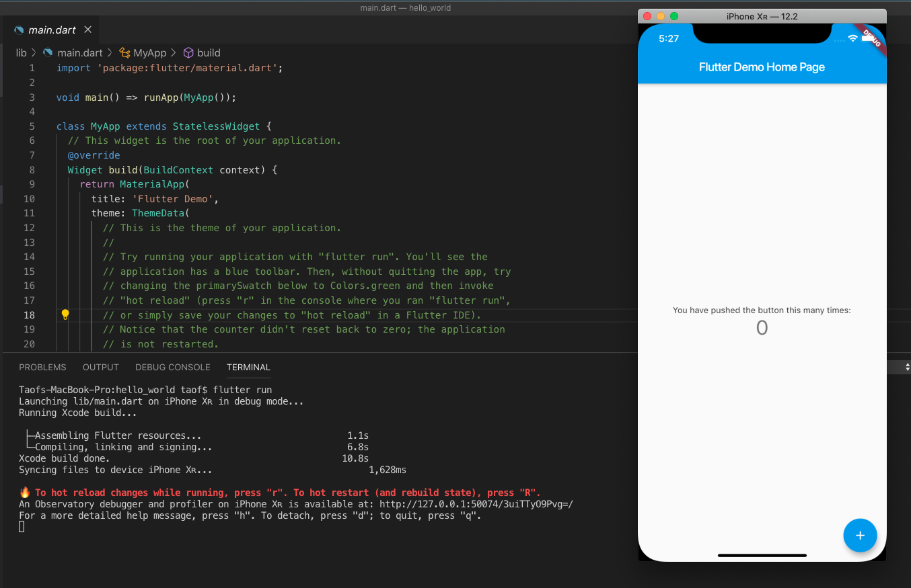
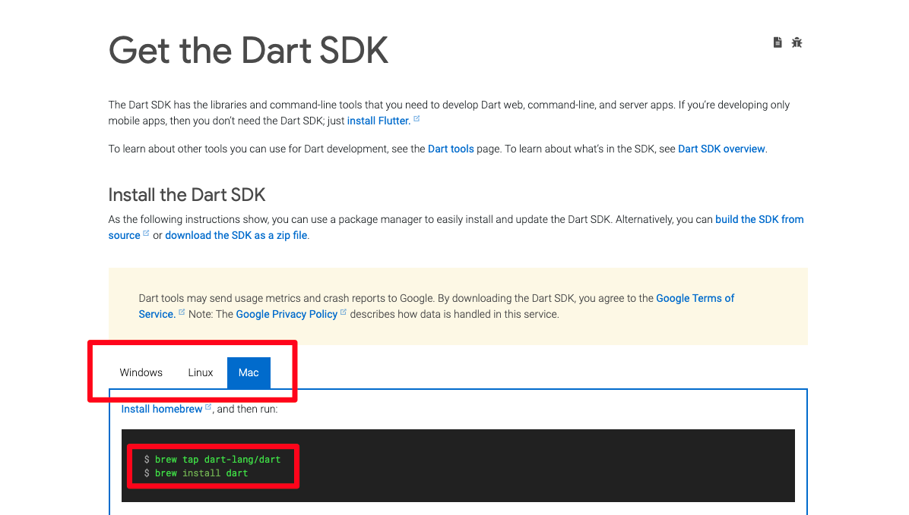
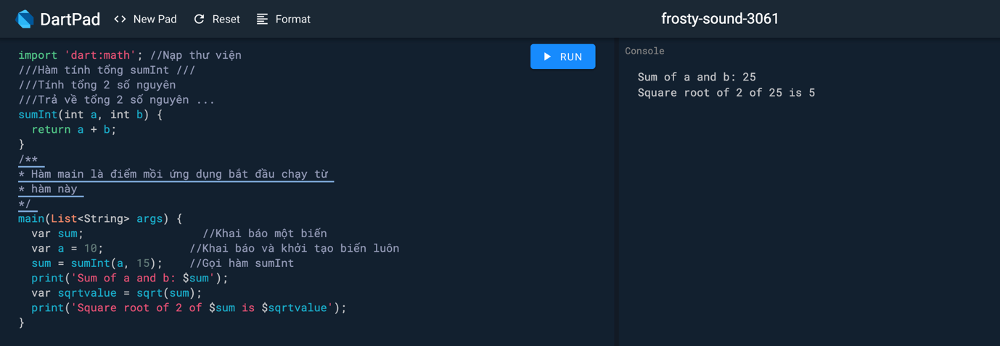

# BÀI 1: GIỚI THIỆU NGÔN NGỮ DART

   Sẽ thật thiếu sót khi chúng ta bỏ qua ngôn ngữ lập trình được dùng trong Flutter - Dart, vì vậy ở bài đầu tiên, ta sẽ cùng tìm hiểu về ngôn ngữ mới mẻ này.

Những thứ ta sẽ tìm hiểu trong phần này:

-   Dart là gì?

-   Tại sao Flutter lại sử dụng Dart?

-   Những ưu điểm của nó?

-   Những khái niệm quan trọng?

-   Cài đặt Dart?

-   Chạy thử và Phân tích code mẫu 1 chương trình Dart đơn giản?

## **DART LÀ GÌ?**

   Dart là ngôn ngữ lập trình đa mục đích ban đầu được phát triển bởi Google và sau đó được Ecma (ECMA-408) phê chuẩn làm tiêu chuẩn. Nó được sử dụng để xây dựng các ứng dụng web, server, máy tính để bàn và thiết bị di động. Dart là ngôn ngữ mã nguồn mở và miễn phí, được phát triển trên GitHub. Hiện nay Dart đã Release phiên bản 2.7 (Thời điểm 2/2020). Bạn có thể tham khảo những nguồn tài liệu chính thức của Dart tại:

-   Trang chính thức: <https://dart.dev/>

-   Editor online: <https://dartpad.dartlang.org/>

-   Thư việc packages: <https://pub.dev>

###    **TẠI SAO FLUTTER LẠI SỬ DỤNG DART?**

   Như đã nói ở trên, Dart được phát triển bởi Google, và Flutter cũng vậy. Google muốn viết (phát triển) một ngôn ngữ mà nó cải tiến hơn Javascript và hỗ trợ cả 2 cách biên dịch là Just In Time (JIT) và Ahead Of Time (AOT):

-   Ahead Of Time (AOT): Với AOT thì trình biên dịch chuyển ngôn ngữ Dart thẳng
    sang Native Code giúp hiệu năng tốt nhất có thể (tức là khi chạy chương
    trình, nó sẽ biên dịch từ đầu đến cuối)

-   Just In Time (JIT): Còn với JIT cho phép hot reloading hoạt động, giúp phát
    triển sản phẩm nhanh và tiện dụng hơn (được hiểu như việc debug trong ngôn
    ngữ khác là debug hàm nào chạy hàm đó thì ở đây nó sẽ viết đến đâu biên dịch
    ngay đến đấy)

###    **ƯU ĐIỂM CỦA DART**

-   **Năng suất:** Cú pháp Dart rõ ràng và súc tích, công cụ của nó đơn giản
    nhưng mạnh mẽ. Type-safe giúp bạn xác định sớm các lỗi tinh tế. Dart có các
    thư viện cốt lõi và một hệ sinh thái gồm hàng ngàn package.

-   **Nhanh:** Dart cung cấp tối ưu hóa việc biên dịch trước thời hạn để có được
    dự đoán hiệu suất cao và khởi động nhanh trên các thiết bị di động và web.

-   **Di động:** Dart biên dịch thành mã ARM và x86, để các ứng dụng di động của
    Dart có thể chạy tự nhiên trên iOS, Android và hơn thế nữa. Đối với các ứng
    dụng web, chuyển mã từ Dart sang JavaScript.

-   **Dễ gần:** Dart quen thuộc với nhiều nhà phát triển hiện có, nhờ vào cú
    pháp và định hướng đối tượng không gây ngạc nhiên của nó. Nếu bạn đã biết
    C++, C \# hoặc Java, bạn có thể làm việc hiệu quả với Dart chỉ sau vài ngày.

-   **Reactive**: Dart rất phù hợp với lập trình Reactive, với sự hỗ trợ để quản
    lý các đối tượng tồn tại trong thời gian ngắn, chẳng hạn như các widget UI,
    thông qua phân bổ đối tượng nhanh và GC. Dart hỗ trợ lập trình không đồng bộ
    thông qua các tính năng ngôn ngữ và API sử dụng các đối tượng Future và
    Stream.

## **NHỮNG KHÁI NIỆM QUAN TRỌNG**

###  **Khái niệm cơ bản**

Nếu như bạn học Dart, hãy luôn ghi nhớ những khái niệm quan trọng sau:

-   Do Dart là ngôn ngữ thuần OOP nên tất cả những thứ bạn gán cho biến đều là
    object, mọi object đều là instance (thể hiện) của một class. Kể cả số,
    method (hàm), và null cũng đều là object. Tất cả các object đều kế thừa từ
    [Object
    class](https://api.dart.dev/dev/2.0.0-dev.55.0/dart-core/Object-class.html).

-   Kiểu type của 1 variable (biến) là optional bởi vì Dart có thể tự suy ra
    type dựa trên giá trị truyền vào cho biến. Ví dụ:

` var number = 42;
//biến number được hiểu là kiểu int. `

- Khi bạn muốn khai báo 1 variable mà type của nó không được xác định, hãy sử dụng [type dynamic](https://dart.dev/guides/language/effective-dart/design#do-annotate-with-object-instead-of-dynamic-to-indicate-any-object-is-allowed).

-   Như các ngôn ngữ khác, Dart hỗ trợ generic type, ví dụ như List\<int\> (1
    danh sách kiểu số nguyên) hoặc List\<dynamic\> (1 danh sách các object mà
    type không xác định, nó có thể chấp nhận mọi loại type).

-   Dart hỗ trợ top-level function (giống như main()), đồng nghĩa bạn có thể sử
    dụng hàm đó ở bất cứ đâu mà không cần thông qua tên class hay bất kỳ
    instance của class nào cả. Bạn cũng có thể tạo một hàm bên trong một hàm
    (còn gọi là nested function hoặc local function).

-   Tương tự Dart cũng hỗ trợ top-level variable.

-   Không giống với Java, Dart không hỗ trợ public, protected, và private. Nếu
    như identifier (tên biến, hàm,...) bắt đầu bởi dấu gạch dưới (_), thì nó
    private trong library của nó. Mỗi file .dart được coi là 1 library. Chi tiết
    [Libraries and
    visibility](https://dart.dev/guides/language/language-tour#libraries-and-visibility).

-   Identifier có thể bắt đầu bằng một chữ cái hoặc dấu gạch dưới (_).

-   Dart tools có thể báo cho bạn 2 loại vấn đề: warnings và errors. Warnings là
    những dấu hiểu chỉ ra rằng code của bạn có thể không hoạt động, nhưng chương
    trình của bạn vẫn có thể chạy. Errors có thể là error lúc compile-time hoặc
    run-time. Error lúc compile-time hiển nhiên sẽ khiến code bạn không chạy
    được, còn kết quả của error run-time sẽ là những
    [exceptions](https://dart.dev/guides/language/language-tour#exceptions) được
    throw ra khi chạy.

### **Quy tắc trình bày Code**

Những quy tắc này không bắt buộc bạn phải tuân theo, nhưng nếu áp dụng code sẽ
trở nên sáng sủa, dễ đọc và thống nhất.

-   Nên đặt tên kiểu **UpperCamelCase** cho lớp, enums, tham số (chữ đầu của từ
    là chữ in: HttpRequest )

-   Tên file, thư viện viết chữ thường, các từ nối với nhau bởi **\_**:
    abc_xyz.dart

-   Biến, hằng, object đặt tên kiểu **lowerCamelCase**, chữ đầu các từ viết IN,
    trừ từ đầu tiên (defaultTimeout)

-   Cố gắng viết tắt khi tên trên 2 từ, lấy ký đầu viết **IN** để tạo chữ viết
    tắt (IOStream \~ InputOutputStream)

## **CÀI ĐẶT DART**

### **Cài đặt Dart SDK**

Dart SDK nó cung cấp những công cụ cần thiết để phát triển ứng dụng viết bằng
Dart. Tùy thuộc sử dụng môi trường nào (Windows, Linux, Mac) thì cài đặt Dart
SDK tương ứng cho môi trường đó. Để cài đặt SDK mọi người vào document của Dart
và làm theo hướng dẫn: [Get the Dart SDK](https://dart.dev/get-dart)

**Các thành phần Dart SDK:**

Những thành phần cốt lõi chạy dart từ dòng lệnh gồm:

-   **dart** máy ảo VM chạy mã Dart

-   **dart2js** biên dịch Dart thành JavaScript

-   **dartanalyzer** phân tích mã viết bằng Dart

-   **dartdevc** công cụ biên dịch cho ứng dụng web

-   **dartdoc** phát sinh tài liệu API

-   **dartfmt** định dạng mã Dart (cho đẹp, cho đúng chuẩn, cho dễ đọc)

-   **pub** quản lý gói trong Dart (giống npm của NodeJS)

### **Lựa chọn IDE để viết code Dart**

Có nhiều IDE phức tạp mà nó hỗ trợ Dart thông qua các plugin như: Android
Studio, IntelliJ IDEA, Visual Studio Code... Tùy mục đích phát triển ứng dụng mà
chọn IDE tương ứng. Đáp ửng đủ nhu cầu thực hành code viết bằng Dart, thì Visual
Studio Code là một lựa chọn tuyệt vời. Ở phần cơ bản về Dart ta sẽ dùng IDE này
(nó miễn phí, mã nguồn mở, rất nhiều plugin cho hầu hết các ngôn ngữ lập
trình...)

Sau khi lựa chọn được IDE phù hợp, chúng ta có thể tạo mới file nguồn với đuôi
.dart

Ngoài ra, Dart còn cung cấp cho bạn một bộ tool trên trình duyệt web được gọi là
DartPad để bạn có thể dễ dàng viết và test Dart. Bạn có thể truy cập vào DartPad
[tại đây](https://dartpad.dartlang.org/). Mặc dù DartPad là một cách tuyệt vời
để tìm hiểu cách viết một ứng dụng đơn giản, nhưng khi bạn đã sẵn sàng để phát
triển các ứng dụng thực sự, bạn cần có SDK.

## **CHƯƠNG TRÌNH DART ĐƠN GIẢN:**

Bạn có thể dùng bất kỳ trình soạn thảo text nào để viết code Dart (hoặc sử dụng
[DartPad](https://dartpad.dartlang.org/)), giờ bạn tạo ra một file đặt tên là
**hello.dart** với nội dung:

`main() {
	print('Hello World!');
}`

Đoạn mã trên in ra màn hình dòng chữ: Hello World!. Để chạy bạn gõ lệnh từ
Terminate (Command Prompt) như sau:

>   \# cd \<thư mục chứa file hello.dart\>

>   \# dart hello.dart

>   Hello World!

Tiếp theo ta tìm hiểu thêm từ một chương trình đơn giản sau:

>   import 'dart:math'; //Nạp thư viện

>   ///Hàm tính tổng sumInt ///

>   ///Tính tổng 2 số nguyên

>   ///Trả về tổng 2 số nguyên ...

>   sumInt(int a, int b) {

>   return a + b;

>   }

>   /\*\*

>   \* Hàm main là điểm mồi ứng dụng bắt đầu chạy từ

>   \* hàm này

>   \*/

>   main(List\<String\> args) {

>   var sum; //Khai báo một biến

>   var a = 10; //Khai báo và khởi tạo biến luôn

>   sum = sumInt(a, 15); //Gọi hàm sumInt

>   print('Sum of a and b: \$sum');

>   var sqrtvalue = sqrt(sum);

>   print('Square root of 2 of \$sum is \$sqrtvalue');

>   }

Kết quả của đoạn mã trên như sau:

Đoạn code đơn giản ở trên dùng nhiều đến những tính năng cơ bản trong Dart, ta
sẽ cùng phân tích:

1.  **Hàm main:**

Một ứng dụng Dart bắt đầu chạy từ hàm main, hàm này bắt buộc phải có, nó có thể
có tham số như khai báo ở trên. Nếu ứng dụng không nhận tham số ở main thì có
thể chỉ cần khai báo:

>   main() {

>   // ...

>   }

**Lưu ý:** Dart có phân biệt chữ hoa/thường nên khi đặt tên cho các thành phần
hàm, biến... cần lưu ý. Hàm main() và hàm maIn() là khác nhau.

1.  **Câu lệnh, khối lệnh:**

Các lệnh trong Dart được viết mà các thành phần không bị ảnh hưởng bởi khoảng
trắng, kết thúc một câu lệnh là dấu **;**

>   //Câu lệnh

>   return a + b;

>   //Viết lại như sau là tương đương

>   return

>   a

>   \+

>   b;

Một nhóm các lệnh nhóm lại với nhau được gọi là một khối lệnh, trong Dart nó sử
dụng cặp dấu **{}** để tạo khối. Khối lệnh có thể lồng nhau.

>   if (a \> 1) {

>   //Khối lệnh 1

>   }

>   else {

>   //Khối lệnh 2

>   }

1.  **Comment – chú thích Code:**

Các chú thích đưa vào trong code thì không ảnh hưởng gì đến code, mục đích nó là
mô tả để đọc lại dễ hiểu, có 2 loại chú thích.

*Chú thích 1 dòng* các chữ phía sau ký hiệu // không ảnh hưởng gì tới code

>   // Đây là chú thích trên 1 dòng

*Chú thích nhiều dòng* các dòng chữ nằm giữa ký hiệu /\* và \*/ không ảnh hưởng
gì tới code.

>   /\*

>   Đây

>   là chú thích

>   nhiều dòng

>   \*/

*Chú thích Documentation* là dòng chữ phía sau ký hiệu ///, nó tương tự như chú
thích 1 dòng, nhưng nội dung viết trong nó viết theo một quy tắc nhất định để
tham khảo tới hàm, biến, lớp ... (tìm hiểu sau), nó giống PHPDoc trong PHP. Mục
đích là để sinh ra tài liệu. Ví dụ nó phát sinh ra tài liệu tham khảo, để người
khác đọc tài liệu này biết sử dụng lại logic của code.

1.  **Nạp thư viện:**

Dart cũng tổ chức code thành các thư viện, có những thư viện xây dựng sẵn như
thư viện toán dart:math ... , cần dùng thư viện nào thì nạp nó vào bằng lệnh
import. Bạn cũng sẽ tự xây dựng các thư viện cho mình và nạp vào bằng cách này,
kể cả nạp một file .dart cũng dùng import.

>   import 'dart:math'; //Nạp thư viện toán

>   //Do có nạp math, mà giờ đây có hàm tính căn bậc 2 sqrt

>   print(sqrt(9));

Trở lại dự án trên của bạn, giờ bạn tạo ra một file khác đặt tên là banner.dart

Nội dung file có định nghĩa hàm banner()

>   void banner() {

>   print("==============================================");

>   }

Sau đó trở lại main.dart, nạp file này vào bằng lệnh import 'banner.dart';, vậy
là trong main.dart gọi được hàm banner();

>   import 'dart:math';

>   import 'banner.dart'; //Nạp thư viện tự xây dựng

>   ...

>   main(List\<String\> args) {

>   banner(); //Được gọi hàm trong thư viện banner.dart

>   var sum;

>   var a = 10;

>   sum = sumInt(a, 15);

>   print('Sum of a and b: \$sum');

>   var sqrtvalue = sqrt(sum);

>   print('Square root of 2 of \$sum is \$sqrtvalue');

>   banner(); //Được gọi hàm trong thư viện banner.dart

>   }

Kết quả của chương trình:

>   ==============================================

>   Sum of a and b: 25

>   Square root of 2 25 is 5

>   ==============================================
